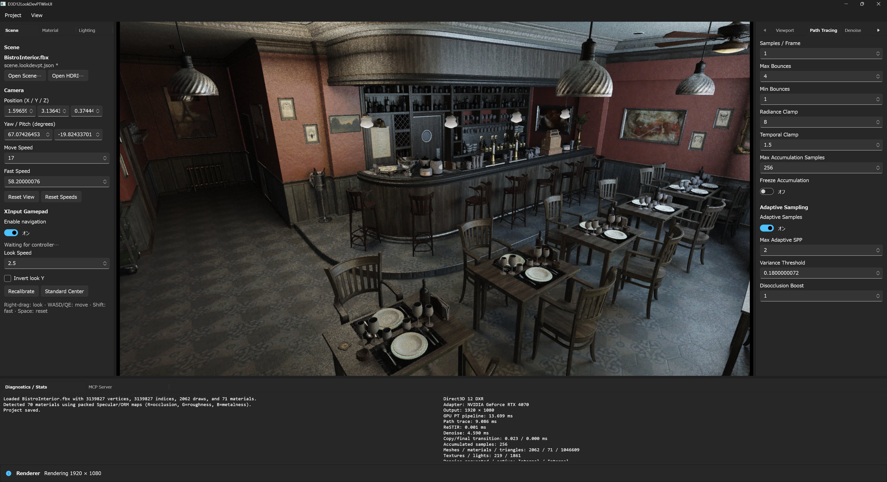
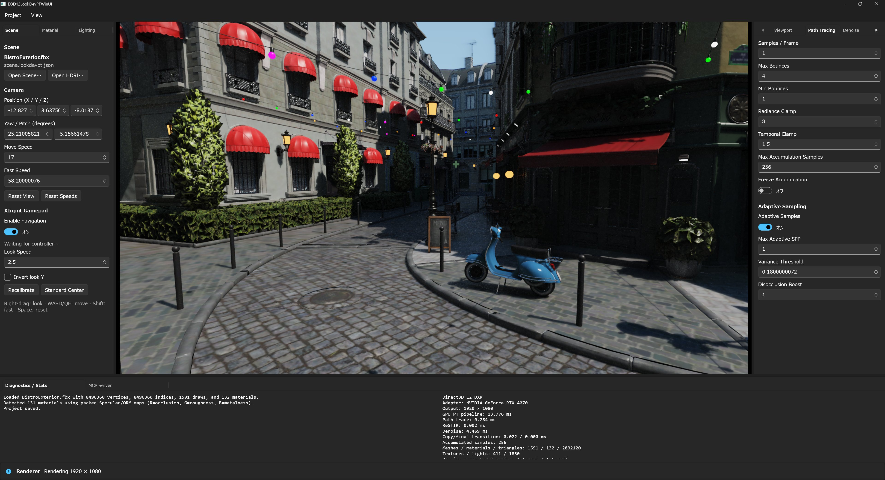

# D3D12LookDevPTwithAI

[English](README.md)

D3D12LookDevPTwithAI は Direct3D 12 / DXR LookDev パストレーサーの
WinUI 3 版です。D3D12LookDevPT の renderer、shader pipeline、project schema、
CLI、benchmark 出力、MCP、optional backend を維持し、ImGui と Win32
application shell を C++/WinRT / WinUI 3 に置き換えています。

移植元は
[shaderjp/D3D12LookDevPT](https://github.com/shaderjp/D3D12LookDevPT) commit
`605fe99dc7bc42863c3d374d532ccc134b9f651d` です。現在の renderer / HLSL には、
その後 ImGui 版へ入った PBRT v4 / TinyEXR import、RTXDI ReSTIR GI / checkerboard
PT、DLSS Ray Reconstruction evaluation、dynamic internal resolution / TAAU、compact
secondary work dispatch、BLAS compaction / instancing、shader ray counter、非同期
scene load、MCP `2026-07-28` transport も合流しています。

## 統合 AI Assistant（実装中）

このブランチでは、別のチャットアプリへ移動せず LookDev の右ドックから操作する
一体型 UI を実装しています。現在の最初の縦断実装には、`Inspector / AI Assistant`
切替、F9、非表示のローカル ChatHost、current-user 限定 named pipe、ストリーミング、
取消、project ごとの SQLite 会話履歴が含まれます。利用者が起動・操作するウィンドウは
`D3D12LookDevPTwithAI.exe` だけです。

製品既定の推論経路は、認証付き loopback 接続で非表示の `llama-server.exe` 子プロセス
を使用します。local の `inference.json` がない状態は正常な初回状態であり、Assistant
は `not_ready` を表示して placeholder 応答へ fallback しません。deterministic runtime
は Debug の end-to-end bridge test 専用で、製品 runtime の fallback ではありません。
ChatHost の会話履歴 API は SQLite の連番 cursor による UTF-8 byte 制限付き page で
取得するため、長期履歴でも 4 MiB の IPC frame 上限を超えません。Native UI が表示する
のは現時点では最新 page で、過去 page の閲覧 UI は後続 milestone です。

同一アプリの MCP Tool 実行、一回承認 grant、アプリ内 model manager、一体型 portable /
offline 展示 pack はまだ実装していません。設計と境界は
[統合アーキテクチャ](docs/integrated-ai-architecture.ja.md)を参照してください。

### ローカル推論の手動 setup

この milestone は数 GB 規模の model や llama.cpp runtime を自動 download しません。
開発時または利用者が明示的に承認した setup として、手元の GGUF と、CPU / CUDA /
Vulkan の llama.cpp runtime directory にある `llama-server.exe` を import します。

```powershell
.\Scripts\ConfigureLocalInference.ps1 `
  -ModelPath 'D:\AI\models\model-q4.gguf' `
  -RuntimePath 'D:\AI\llama-cpu\llama-server.exe' `
  -ModelId 'model-q4' `
  -Backend cpu `
  -ContextSize 4096 `
  -MaxTokens 1024 `
  -Temperature 0.2 `
  -AcceptArtifactLicenses
```

`-AcceptArtifactLicenses` は、指定 artifact を使用する操作者の明示判断を記録するもので、
入手元を認証するものではありません。既存設定を置き換える場合は
`-ReplaceConfiguration` も必要です。

script は GGUF と runtime directory 全体を
`%LOCALAPPDATA%\D3D12LookDevPTwithAI\AI\Models` / `Runtimes` 以下へコピーし、
`inference.json` を atomic に書き込みます。設定には model、`llama-server.exe`、および
それ以外の全 runtime file を必須 `runtimeDependencies` manifest として列挙し、各 file
の size と SHA-256 を記録します。ChatHost は起動時に runtime tree の完全一致と全 entry
を検証します。子プロセスの生存中は既存 file の read lease と directory handle を保持し、
runtime tree の変更監視で追加・削除・更新を検出した場合は session を失効させて子を停止します。

非表示 server は `127.0.0.1` の ephemeral port だけへ bind し、起動ごとに新しい
256-bit API key を受け取ります。Native application は検証済み PID と kill-on-close
Job Object で ChatHost を所有し、llama.cpp の子孫プロセスも同じ所有 chain に残して
終了時に破棄します。公式署名済み artifact catalog / manifest と一体型 portable /
offline pack は後続の配布 milestone です。手動設定は展示 release の trust path では
ありません。

## スクリーンショット

| Bistro Interior | Bistro Exterior |
|:---:|:---:|
|  |  |

WinUI から6種類すべての render mode、quality profile / ray budget、固定・動的
render scale、camera roll / FOV、scene load progress / cancel、7番目の alpha texture
slot、RTXDI / DLSS の詳細 status を操作・確認できます。

## 対応環境

- Windows 11 x64、DXR Tier 対応 GPU
- Visual Studio 2026、Desktop development with C++ および C++ WinUI tooling
- MSVC `v145`
- Windows SDK `10.0.26100.0`
- Windows App Runtime 2.4 x64
- .NET 9 SDK（build）および .NET 9 Runtime x64（現在の ChatHost 実行）
- submodule 対応 Git

Debug / Release build は unpackaged、Windows App SDK framework-dependent です。
Release は Hybrid CRT を使用します。
VS 2022 / `v143`、MSIX、ARM64 は対象外です。

Visual Studio project は次の NuGet package を固定します。

| Package | Version |
|---|---:|
| Microsoft.WindowsAppSDK | 2.4.0 |
| Microsoft.Windows.CppWinRT | 2.0.250303.1 |
| Microsoft.Direct3D.D3D12 | 1.619.3 |
| Microsoft.Direct3D.DXC | 1.9.2602.17 |

初回 build の前に setup checker を実行してください。

```powershell
.\Scripts\CheckSetup.ps1 -CheckDLSS -CheckNRD
```

Windows App Runtime 2.4 x64 や build component が不足している場合は、checker
が具体的な不足項目を表示します。unpackaged executable の起動前に、対応する
Windows App Runtime redistributable をインストールしてください。

## Clone と build

ThirdParty を固定 revision で取得するため、recursive clone します。

```powershell
git clone --recursive <repository-url> D3D12LookDevPTwithAI
cd D3D12LookDevPTwithAI
git submodule update --init --recursive
```

`D3D12LookDevPTwithAI.sln` を開き、`Debug|x64` または `Release|x64` を選択し、
NuGet restore 後に build します。Local Windows Debugger 構成済みなので、F5
で unpackaged WinUI executable を起動できます。

command line からの build 例です。

```powershell
$msbuild = "C:\Program Files\Microsoft Visual Studio\18\Insiders\MSBuild\Current\Bin\amd64\MSBuild.exe"
& $msbuild .\D3D12LookDevPTwithAI.sln /m /restore /p:Configuration=Debug /p:Platform=x64
```

repository既定backendは`DLSS=false`、`NRD=true`、`RTXDI=false`です。各backendは
個別に上書きできます。

```powershell
& $msbuild .\D3D12LookDevPTwithAI.sln /m /p:Configuration=Release /p:Platform=x64 `
  /p:EnableDLSS=false /p:EnableNRD=false /p:EnableRTXDI=false
```

Assimp、DirectXTex、NRD、RTXDI は `BuildThirdParty.ps1` が必要時に build
します。optional backend matrix は次のコマンドで検証できます。

```powershell
.\Scripts\BuildBackendMatrix.ps1 -Configuration Release -SkipLaunch
```

出力先は `Bin\x64\<Configuration>` です。Agility SDK、DXC で生成した shader、
利用可能な Streamline / DLSS runtime も executable の横へコピーされます。

## 再現可能な開発環境とPortableスイート

> この節の script は移行元の外部 `LocalMCPChatClient` を組み合わせる既存 pipeline
> です。統合 Assistant の一体型配布としてはまだ使用しません。

`suite.lock.json` schema v2でLocalMCPChatClientの互換commit、SDK、package、
model/projector、llama runtimeを固定します。D3D12自身は`source: self`とし、実際に
buildした両repositoryのcommitは生成済みsuite manifestへ記録します。`.vsconfig`と`config/development.dsc.yaml`はVisual
StudioとWinGet Configurationの前提を定義します。bootstrapは冪等で、
`-InstallPrerequisites`を明示した場合だけsystemを変更します。

```powershell
.\Scripts\BootstrapSuite.ps1 -LocalMcpRepository ..\LocalMCPChatClient
```

公開ベータ用の`DLSS=false / NRD=false / RTXDI=false` suiteを生成します。

```powershell
.\Scripts\BuildPortableSuite.ps1 -LocalMcpRepository ..\LocalMCPChatClient `
  -OutputDirectory .\artifacts\D3D12LookDevPTwithAI-0.2.0-beta.1-win-x64
```

ZIPにはframework-dependentなD3D12 application、self-containedなLocalMCPChatClient、
Agility SDK、launcher、online install、clean uninstall、license、file単位license map、
SPDX SBOM、version固定manifest、全fileとarchiveのSHA-256が入ります。target PCでは
現在userの`%LocalAppData%\Programs`へ展開し、Visual Studioと.NETを要求しません。
初回起動時にMicrosoft署名済みWindows App Runtime 2.4.0 installerを公式URLから取得し、
固定SHA-256とAuthenticode署名を検証します。非昇格時は現在userへruntimeを導入します。
`0.2.0-beta.1`はコード署名のない公開ベータです。ZIP内の
`UNSIGNED-BETA.ja.txt`とarchiveのSHA-256を確認してください。launcherはMCP serverと
90秒のpairing codeを開始し、LocalMCPChatClientの初回画面からmodel取得前に交換します。
`BuildOfflinePack.ps1`ではmodel/projectorと選択したCPU/CUDA/Vulkan llama runtimeを
追加できますが、token、資格情報、承認rule、会話履歴は含めません。

## 起動

preview cube で editor を起動します。

```powershell
.\Bin\x64\Debug\D3D12LookDevPTwithAI.exe
```

Project menu から PBRT / glTF / GLB / FBX / OBJ scene、environment、schema v2
project を開けます。移植元と
同じ CLI path option も使用できます。

```powershell
.\Bin\x64\Debug\D3D12LookDevPTwithAI.exe `
  --scene .\Bistro_v5_2\BistroExterior.fbx `
  --environment .\Bistro_v5_2\san_giuseppe_bridge_4k.hdr

.\Bin\x64\Debug\D3D12LookDevPTwithAI.exe `
  --project .\projects\benchmark_interactive.lookdevpt.json
```

`Bistro_v5_2` は local test asset であり、git の対象外です。配置については
[Asset setup](docs/assets.ja.md) を参照してください。

### glTF材質とtexture経路

glTF / GLBはAssimpではなくtinygltfベースの専用経路でimportします。
`TEXCOORD_0/1`、embedded / data URI画像、texture transform、specular、IOR、
transmission、volume、clearcoat、`KHR_texture_basisu`に対応し、非破壊override用に
`gltf:material/<index>`形式の安定IDを保持します。未対応の必須extensionはimportを
停止し、任意extensionのfallbackはscene監査へ出力します。

material textureはnative BC DDS / KTX2 mip、Basis ETC1S / UASTC KTX2、EXR、HDR、
通常のdecode imageに対応します。旧512px material / HDRI制限は撤廃しました。
slotごとのAuto / Source / 4K / 2K / 1K / 512とDXGI-awareなtexture budgetを使い、
environment importance mapだけは独立した最大1024px sourceです。animation、
skinning、morph target、hierarchy編集、raster fallbackは今回の対象外です。
詳細は[Asset setup](docs/assets.ja.md)を参照してください。

## WinUI editor

固定 IDE 型 layout には移植元と同じ9 panelがあります。

- 左: Scene、Material、Lighting
- 右: Viewport、Path Tracing、Denoise、ReSTIR
- 下: Diagnostics、MCP の `TabView`

左、右、下領域は splitter で resize できます。View menu から panel 表示、
Show All、Reset Default Layout、F10 Render Only、および System / Light / Dark
theme を操作できます。幅、選択 tab、表示状態、選択した theme は次へ保存されます。

```text
%APPDATA%\D3D12LookDevPTwithAI\ui.json
```

display resolution は window size と独立しています。720p / 1080p / 4K の変更時は
output / swap-chain resource を resize し、Path Tracing panel では別に native、
fixed-scale、budget-driven dynamic internal resolution を選択できます。DLSS 以外の
scaled rendering は TAAU を使います。WinUI は16:9の composition surface を
aspect-fit、letterbox 表示します。

viewport の操作は移植元と同じです。

- 右 drag: 視点操作
- W / A / S / D、Q / E: 移動
- Shift: 高速移動
- Space: accumulation history reset
- F10: Render Only mode の切替
- XInput: 左 stick 移動、右 stick 視点、trigger 下降・上昇

camera input は viewport focus 中だけ有効で、`TextBox` や `NumberBox` の編集中は
無効になります。

## Renderer / UI の thread 境界

`RendererController` は D3D12 device、scene、renderer state、MCP dispatcher
を1本の `std::jthread` で所有します。WinUI thread は型付き `RendererCommand`
を送り、`EditorViewModel` 経由で immutable `RendererSnapshot` を読み取ります。

連続 control は setting と material / texture target 単位で coalesce します。
load、save、承認、拒否など順序が必要な action は FIFO を維持します。
validation、dirty state、resource refresh、history invalidation は WinUI と MCP
のどちらからでも renderer thread 上で適用されます。

viewport は `CreateSwapChainForComposition` で作る3-buffer composition swap
chain、`FLIP_SEQUENTIAL`、stretch scaling、frame-latency waitable object を
使用します。WinUI thread は `ISwapChainPanelNative` で attach / detach します。
終了時は renderer を静止し、UI thread で swap chain を detach、GPU wait、
renderer resource 解放の順に処理します。

## Project、設定、log

schema v2 `.lookdevpt.json` と renderer CLI は移植元と互換です。schema v3は
bundle import用の`assetRoot`を追加し、通常保存はv2を維持します。scene または
project の load に失敗しても、現在の scene を維持します。

WinUI 版の user data は元アプリと競合しない専用 path に保存します。

```text
%APPDATA%\D3D12LookDevPTwithAI\settings.json
%APPDATA%\D3D12LookDevPTwithAI\startup.json
%APPDATA%\D3D12LookDevPTwithAI\materials\
%APPDATA%\D3D12LookDevPTwithAI\ui.json
%TEMP%\D3D12LookDevPTwithAI.log
```

Assistant data は current user の local profile 以下へ分離します。

```text
%LOCALAPPDATA%\D3D12LookDevPTwithAI\AI\chat-history.sqlite3
%LOCALAPPDATA%\D3D12LookDevPTwithAI\AI\Models\
%LOCALAPPDATA%\D3D12LookDevPTwithAI\AI\Runtimes\
%LOCALAPPDATA%\D3D12LookDevPTwithAI\AI\inference.json
```

project path は absolute または `baseDirectory` 基準の relative path を
使用できます。bundle内部のv3 pathは`assetRoot`以下で解決され、absolute pathや
`..`による脱出を拒否します。`Scripts\LookDevBundle.ps1`はZIPベースの`thin` /
`portable` `.lookdevbundle`をpath、容量、SHA-256、license検証付きで作成・安全に
importします。例は [Asset setup](docs/assets.ja.md) にあります。

## MCP

MCP panel から `http://127.0.0.1:<port>/mcp` の local endpoint を開始できます。
primary bearer tokenはWindows Credential Managerへ保存し、`settings.json`には
credential参照だけを残します。既存の平文設定は初回起動時に移行します。
read-only、confirm-mutations、allow-mutations に対応しています。同じ endpoint で
MCP `2026-07-28`、legacy session client、resource subscription を提供します。
confirm mode の mutation は MCP panel で Approve / Reject し、editor command と
同じ renderer-thread safe point で実行されます。

`initialize.experimental.lookdevpt.contractVersion`はcontract v1を公開し、
`lookdevpt://integration`で同じ診断機能を確認できます。MCP panelは90秒・1回限り・
5回失敗までの8桁LocalMCPChatClient pairing codeを発行し、client失効もできます。
server側は発行tokenのSHA-256 hashだけを保持します。検出とpairingもloopback限定で、
MCPと同じOrigin検証を適用します。

CLI から開始する例です。

```powershell
.\Bin\x64\Debug\D3D12LookDevPTwithAI.exe `
  --mcp-server --mcp-port 8777 --mcp-token <token> `
  --mcp-access confirm_mutations
```

tool、resource、prompt、client 設定は [MCP integration](docs/mcp.ja.md) を参照して
ください。

## Benchmark

benchmark CLI と JSON field 名は変更していません。

```powershell
.\Bin\x64\Release\D3D12LookDevPTwithAI.exe `
  --project .\projects\benchmark_interactive.lookdevpt.json `
  --benchmark --benchmark-kind performance `
  --camera-path .\benchmarks\bistro_exterior_stability.camera.json `
  --frames 300 --warmup 120 --seed 1 `
  --output .\benchmark-output\performance
```

WinUI 版の `cpu_ui_ms` は editor command 処理と snapshot 生成時間です。
`gpu_ui_ms` は最後の swap-chain transition であり、WinUI は別に composition
されるため ImGui の GPU pass はありません。

capture、AOV、sequence 解析は [Benchmark guide](benchmarks/README.md) を参照して
ください。

MCP clientは`start_benchmark`、`get_benchmark`、`cancel_benchmark`で同じharnessを
非同期実行し、`lookdevpt://benchmarks/{id}`を購読してCSV、quality JSON、capture、
AOV artifactを取得できます。完了または中止後はcheckpointから対話状態を復元します。

## Test

継承した test と WinUI thread 境界の test を PowerShell から実行します。

```powershell
.\Scripts\TestProjectPaths.ps1
.\Scripts\TestLookDevBundle.ps1
.\Scripts\TestOfflinePack.ps1
.\Scripts\TestQualitySettingsJson.ps1
.\Scripts\TestTextureLoader.ps1
.\Scripts\TestGltfSceneImporter.ps1
.\Scripts\TestBenchmarkHarness.ps1
.\Scripts\TestBenchmarkSequenceAnalyzer.ps1
.\Scripts\TestRendererCommandQueue.ps1
.\Scripts\TestPbrtSceneImporter.ps1
.\Scripts\TestTinyExrLoader.ps1
.\Scripts\TestTransientResourceAllocator.ps1
.\Scripts\TestMcpServer.ps1
.\Scripts\TestPbrtDxrContracts.ps1
.\Scripts\TestConfigureLocalInference.ps1
.\Scripts\TestAssistantProtocol.ps1
.\Scripts\TestAssistantHostBridge.ps1
```

`TestAssistantHostBridge.ps1` は deterministic inference hook を明示的に選択する
Debug E2E test です。通常の app / ChatHost 起動では、設定済みの llama.cpp 経路を
使用します。renderer command queue の test は command coalescing、FIFO barrier、
index 付き target、immutable snapshot の atomic publish を検証します。

## ThirdParty revision

ImGui は含みません。その他は移植元と同じ revision へ固定しています。

| Dependency | Commit |
|---|---|
| DLSS | `a291cc7d2cc642a51566f3dfd5376f635cd1b284` |
| DirectXTex | `0405ccf4b834404828c1b5bd54f4ae0f1554d0d5` |
| NRD | `792eff196afdd350fd9c3f862119017ccb438a0e` |
| RTXDI | `274141af082050c9d0ad6e01a2e591d0d66b7955` |
| Streamline | `e8aaa6eaac968711fb62473d4ae8256dde20919b` |
| Assimp | `e04b60f61522e1d5594ef25addcfae7cb156f085` |
| TinyEXR | `1b106618644dbf8a0935c2348ba51a2d863dd7c2` |
| tinygltf 2.9.6 | `26422192e2908a562b641175dde18489824e609e` |
| Basis Universal 2.50 | `9bebe16726b3a61c8c213eeee3b7cffb462ef34e` |

RTXDI の nested dependency `Libraries/Rtxdi` は
`a14e079c727ed8c4fd3173bd2aea8244c9d9f6d6` です。

## Shader

ReSTIR GI / PT、DLSS preparation、compact secondary-work generation、TAAU、quality
counter を含む現行の共有 HLSL / HLSLI pipeline を使用します。`CompileShaders` は
全 source/output pair を追跡し、生成した `.cso` を executable 横へコピーします。
WinUI composition は DXGI 側で行い、UI 専用 shader pass は追加しません。

## 関連文書

- [Asset setup](docs/assets.ja.md)
- [Rendering pipeline](docs/rendering-pipeline.ja.md)
- [MCP integration](docs/mcp.ja.md)
- [DLSS integration](docs/dlss.ja.md)
- [NRD integration](docs/nrd.ja.md)
- [RTXDI integration](docs/rtxdi.ja.md)
- [Benchmark guide](benchmarks/README.md)

## License

[LICENSE](LICENSE) を参照してください。ThirdParty は各licenseに従います。
Portable SuiteはtinygltfのMIT license、Basis UniversalのApache-2.0 license / NOTICE
（Zstandard licenseを含む）を収集し、全同梱fileをlicense allowlistとSPDX 2.3 SBOMへ
対応付けます。設計時に`nvpro-samples/vk_gltf_renderer`を参考にしましたが、Vulkan、
`nvpro_core`、UI source codeは取り込んでいません。
