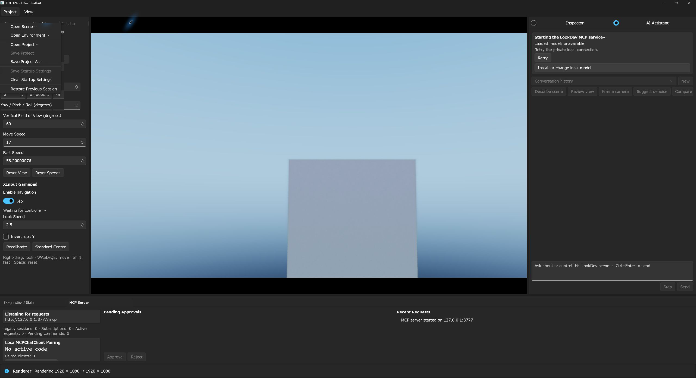
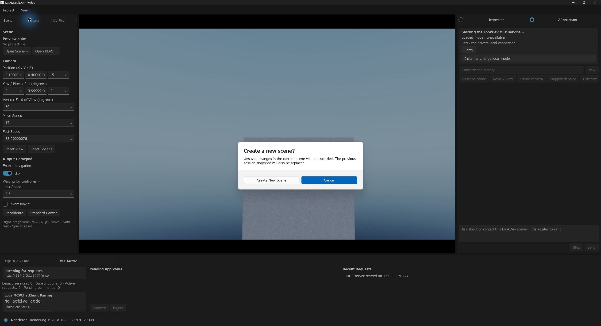

# D3D12LookDevPTwithAI

[日本語](README.ja.md)

D3D12LookDevPTwithAI is the WinUI 3 edition of the Direct3D 12 / DXR
look-development path tracer. It preserves the renderer, shader pipeline,
project schema, command line, benchmark output, MCP tools, and optional
backends from D3D12LookDevPT while replacing ImGui and the Win32 application
shell with C++/WinRT and WinUI 3.

This repository was ported from
[shaderjp/D3D12LookDevPT](https://github.com/shaderjp/D3D12LookDevPT) commit
`605fe99dc7bc42863c3d374d532ccc134b9f651d`. The current renderer and HLSL
also include the later ImGui-edition work for PBRT v4 / TinyEXR import,
RTXDI ReSTIR GI and checkerboard PT, DLSS Ray Reconstruction evaluation,
dynamic internal resolution with TAAU, compact secondary work dispatch, BLAS
compaction / instancing, shader ray counters, asynchronous scene loading, and
the MCP `2026-07-28` transport.

## Integrated AI Assistant

The current application uses a single-window workflow: the user controls
LookDev from the right-side AI Assistant instead of switching to a separate
chat application. The dock includes the Inspector / AI Assistant switch, F9,
quick prompts, conversations, streaming, cancellation, `Ctrl+Enter` send, the
loaded model and backend, and an animated state for model startup, generation,
tool execution, and approval waits. The only window the user launches or
operates is `D3D12LookDevPTwithAI.exe`; ChatHost and llama.cpp are owned hidden
child processes.

The product-default inference path now talks to a hidden `llama-server.exe`
child over an authenticated loopback connection. A missing local
`inference.json` is the normal first-run state: the Assistant reports
`not_ready` and does not substitute a placeholder response. The deterministic
runtime is reserved for the Debug end-to-end bridge test and is not a product
fallback. The ChatHost history API uses SQLite sequence cursors and UTF-8
byte-bounded pages so long histories cannot exceed the 4 MiB IPC frame limit.
The native UI currently displays the latest page; browsing older pages is a
subsequent UI milestone.

The private same-instance MCP transport and native one-time approval boundary
are implemented. ChatHost accepts only the parent-owned
`127.0.0.1` endpoint, preserves `readOnlyHint`, and requires a 30-second
single-use grant bound to the MCP session, tool name, and canonical argument
hash for every non-read-only call. The native endpoint rejects invalid or
unauthorized requests before buffering their bodies, applies a 10-second
receive deadline, and caps buffered bodies at 16 MiB per request and 32 MiB
globally. Private legacy sessions are renewed after server restart or idle
expiry and are best-effort deleted when ChatHost stops. The llama inference
adapter now exposes the live MCP catalog to the model and runs a bounded
multi-round tool loop. Read-only tools execute automatically; every mutation
shows its exact canonical arguments in the LookDev dock and requires a native
one-time approval. Tool progress and results stay in the same window, while
only the user message and final visible assistant response are persisted. A
fixed-revision in-app setup for Gemma 4 and llama.cpp and a manual, unsigned
one-app exhibition pack are available. Text chat and tool use are implemented;
the model is not given viewport pixels, so its scene understanding comes from
MCP state and diagnostics rather than vision. An arbitrary-model manager and
an officially signed artifact catalog remain pending. See the
[integrated architecture](docs/integrated-ai-architecture.ja.md).

### Local inference setup

After the user reviews and explicitly accepts the licenses, the Assistant's
`Download & set up` action downloads a fixed revision of Gemma 4 E2B or E4B and
the llama.cpp b10205 CPU, CUDA, or Vulkan runtime. It displays the current file,
received and total bytes, and overall percentage. Cancellation keeps a
`.partial` file so the same setup can resume with an HTTP Range request. Fixed
sizes and SHA-256 hashes are verified before `inference.json` is replaced.

| Model and backend selection | Download and verification progress |
|:---:|:---:|
|  |  |

Model loading is lazy. `Loaded model: none` is therefore expected immediately
after startup; after the first turn starts, the dock reports the actual model
name and runtime backend. Press `Ctrl+Enter` to send a multiline prompt and
`Enter` alone to insert a line break.

For development with a custom GGUF or an existing llama.cpp runtime, import the
artifacts with the existing script:

```powershell
.\Scripts\ConfigureLocalInference.ps1 `
  -ModelPath 'D:\AI\models\model-q4.gguf' `
  -RuntimePath 'D:\AI\llama-cpu\llama-server.exe' `
  -ModelId 'model-q4' `
  -Backend cpu `
  -ContextSize 16384 `
  -MaxTokens 1024 `
  -Temperature 0.2 `
  -AcceptArtifactLicenses
```

`-AcceptArtifactLicenses` records the operator's explicit decision to use the
supplied artifacts; it does not certify their origin. If a configuration
already exists, replacement also requires `-ReplaceConfiguration`.

The script copies the GGUF and the complete runtime directory beneath
`%LOCALAPPDATA%\D3D12LookDevPTwithAI\AI\Models` and `Runtimes`, then writes
`inference.json` atomically. The document records the size and SHA-256 of the
model, `llama-server.exe`, and every other runtime file in the required
`runtimeDependencies` manifest. At startup, ChatHost requires an exact runtime
tree match and verifies every entry. For the child lifetime it retains read
leases for existing files and directory handles; a runtime-tree mutation
monitor invalidates the session and stops the child on any add, remove, or update.

The hidden server binds to `127.0.0.1` on an ephemeral port and receives a new
256-bit API key on each start. The native application owns ChatHost by verified
PID in a kill-on-close Job Object; the llama.cpp descendant stays in that
ownership chain and is terminated with the app. The integrated portable builder
can package these manually supplied artifacts after explicit license and
unsigned-trust acceptance. An official signed artifact catalog/manifest remains
a later distribution milestone; a local SHA-256 manifest proves integrity, not
artifact provenance.

## Screenshots


| AI-approved LookDev mutation | In-app local model setup |
|:---:|:---:|
|  |  |

| AI tool execution and live progress | Denoise backend controls |
|:---:|:---:|
|  |  |

| Material editing | Lighting editing |
|:---:|:---:|
|  |  |

The current WinUI controls expose all six render modes, quality profiles and
ray budgets, fixed/dynamic render scale, camera roll/FOV, scene-load progress
and cancellation, material texture residency, PBRT dielectric materials, and
detailed RTXDI / DLSS status. The screenshots use local Bistro and PBRT sample
assets that are intentionally not stored in this repository.

## Supported environment

- Windows 11 x64 with a DXR Tier-capable GPU
- Visual Studio 2026 with Desktop development with C++ and C++ WinUI tooling
- MSVC `v145`
- Windows SDK `10.0.26100.0`
- Windows App Runtime 2.4 x64
- .NET 9 SDK for building ChatHost and its tests. ChatHost is self-contained in
  both the normal build output and the integrated portable payload; a separate
  .NET runtime installation is not required to run a complete build output
- Git with submodule support

Ordinary Debug and Release builds are unpackaged and Windows App SDK
framework-dependent; Release uses the Hybrid CRT. The explicit NVIDIA Release
builder overrides the native build to app-local Windows App SDK deployment.
VS 2022 / `v143`, MSIX, and ARM64 are not supported.

The Visual Studio project pins these NuGet packages:

| Package | Version |
|---|---:|
| Microsoft.WindowsAppSDK | 2.4.0 |
| Microsoft.Windows.CppWinRT | 2.0.250303.1 |
| Microsoft.Direct3D.D3D12 | 1.619.3 |
| Microsoft.Direct3D.DXC | 1.9.2602.17 |

Run the setup checker before the first build:

```powershell
.\Scripts\CheckSetup.ps1 -CheckNRD
```

The checker reports a clear failure if Windows App Runtime 2.4 x64 or a
required build component is missing. Install the matching Windows App Runtime
redistributable before running the unpackaged executable.

For a full NVIDIA development environment, use the manifest-driven setup. It
checks the GPU/driver, pinned Streamline, DLSS, NRD and RTXDI revisions,
headers, licenses and generated libraries in one pass, and supports SDK roots
outside the repository:

```powershell
$env:D3D12LOOKDEVPT_NGX_APPLICATION_ID = '<NVIDIA-issued decimal ID>'
.\Scripts\SetupNvidiaEnvironment.ps1 -Profile LocalNvidia -InitializeSubmodules
.\Scripts\SetupNvidiaEnvironment.ps1 -Profile LocalNvidia -Configuration Debug -Build
```

An explicit NVIDIA release builder enables all three renderer backends, stages
required runtime DLLs and licenses, and creates a SHA-256 inventory without
recording the NGX application ID. Target machines still require the current
Microsoft Visual C++ x64 Redistributable compatible with the v145 toolset:

```powershell
.\Scripts\BuildNvidiaRelease.ps1 -AcceptNvidiaLicense
```

Review the [NVIDIA setup and redistribution boundary](docs/nvidia-setup.md)
before publishing a payload.

## Clone and build

Clone recursively so that all pinned third-party repositories are present:

```powershell
git clone --recursive https://github.com/shaderjp/D3D12LookDevPTwithAI.git
cd D3D12LookDevPTwithAI
git submodule update --init --recursive
```

Open `D3D12LookDevPTwithAI.sln`, select `Debug|x64` or `Release|x64`, restore
NuGet packages, and build. The project is configured for Local Windows
Debugger, so F5 launches the unpackaged WinUI executable.

The command-line equivalent is:

```powershell
$vswhere = "${env:ProgramFiles(x86)}\Microsoft Visual Studio\Installer\vswhere.exe"
$vsRoot = & $vswhere -latest -products * -requires Microsoft.Component.MSBuild -property installationPath
$msbuild = Join-Path $vsRoot 'MSBuild\Current\Bin\MSBuild.exe'
& $msbuild .\D3D12LookDevPTwithAI.sln /m /restore /p:Configuration=Debug /p:Platform=x64
```

The repository default backend configuration is `DLSS=false`, `NRD=true`, and
`RTXDI=false`. Each backend can be overridden independently:

```powershell
& $msbuild .\D3D12LookDevPTwithAI.sln /m /p:Configuration=Release /p:Platform=x64 `
  /p:EnableDLSS=false /p:EnableNRD=false /p:EnableRTXDI=false
```

Assimp, DirectXTex, NRD, and RTXDI are built on demand by
`BuildThirdParty.ps1`. To build the supported optional-backend matrix:

```powershell
.\Scripts\BuildBackendMatrix.ps1 -Configuration Release -SkipLaunch
```

Build output is written to `Bin\x64\<Configuration>`. The project copies the
Agility SDK and DXC-produced shaders beside the executable. A DLSS-enabled
build also copies available Streamline / DLSS runtimes.

Run and copy the complete output directory. Copying only
`D3D12LookDevPTwithAI.exe` is unsupported because the sibling ChatHost, its
self-contained .NET files, Windows App SDK files, shaders, and renderer
runtimes are also required. An incomplete copy can produce a misleading
"install or update .NET" dialog when ChatHost starts.

## Integrated one-app portable exhibition package

`BuildIntegratedPortable.ps1` creates a clean Release x64 payload in which the
user launches only `D3D12LookDevPTwithAI.exe`. The hidden ChatHost, .NET runtime,
Windows App SDK, Agility SDK, DXC, app-local VC runtime, licenses, file-level
license map, SPDX SBOM, and integrity manifests are placed beside it. It does
not contain `LocalMCPChatClient`, the old two-process launcher, credentials,
approval state, user settings, or conversation history.
This vendor-neutral exhibition path deliberately builds renderer backends as
`DLSS=false`, `NRD=false`, and `RTXDI=false`. Use the separately reviewed
NVIDIA Release workflow when those SDKs/runtimes must be distributed.

PowerShell 7.4 or later is required. An exhibition build includes AI by default
and requires an already prepared `AI` directory, its exact `inference.json`, and
a schema-v1 redistribution manifest containing `name`, `revision`, HTTPS
`sourceUrl`, SPDX `licenseExpression`, and `licenseFile` for both the model and
runtime. The output directory must be outside the source repository; it and its
ZIP/hash sidecars must not already exist:

```powershell
.\Scripts\BuildIntegratedPortable.ps1 `
  -OutputDirectory ..\artifacts\D3D12LookDevPTwithAI-integrated-win-x64 `
  -AiArtifactDirectory 'D:\AI\LookDevPack\AI' `
  -AiArtifactManifest 'D:\AI\LookDevPack\AI\inference.json' `
  -AiRedistributionManifest 'D:\AI\LookDevPack\AI\redistribution.json' `
  -AcceptArtifactLicenses `
  -AcceptUnsignedArtifactTrust
```

The builder performs no model/runtime download. It verifies the declared GGUF,
`llama-server.exe`, every runtime dependency, and license document in isolated
transaction staging before publication. Build-time NuGet restore still uses
the operator's configured feeds and cache; this manual unsigned path does not
authenticate those build
inputs or promise bit-for-bit reproducibility. The resulting ZIP and manifest
contain SHA-256 integrity data, but are not signatures; deliver their digest
over an authenticated channel.
Bundled `AI` is treated as read-only, while chat history remains under the
current user's `%LOCALAPPDATA%`. This milestone supports text chat and
same-instance MCP tools only; it does not package an `mmproj` or claim vision
support. `-WithoutAi` is an explicit renderer-development pack, not the default
exhibition configuration.

Run the bounded packaging regression independently with:

```powershell
.\Scripts\TestIntegratedPortable.ps1
```

An officially signed artifact catalog, arbitrary-model management UI, and a
signed product release remain future work.

### Archived two-app transition scripts

`BootstrapSuite.ps1`, `BuildPortableSuite.ps1`, and `BuildOfflinePack.ps1`
remain only to reproduce or migrate the older `0.2.0-beta.1` workflow with an
external `LocalMCPChatClient`. They are not the current setup path, release
package, or acceptance target. New development and exhibition builds should
use the integrated Assistant and `BuildIntegratedPortable.ps1`. The continued
presence of these scripts does not mean that a second application, pairing
code, projector, or vision model is required by the integrated product.

## Run

Launch the editor with the preview cube:

```powershell
.\Bin\x64\Debug\D3D12LookDevPTwithAI.exe
```

Open a PBRT / glTF / GLB / FBX / OBJ scene, environment, or schema-v2 project
from the Project menu, or pass
the same paths used by the original application:

```powershell
.\Bin\x64\Debug\D3D12LookDevPTwithAI.exe `
  --scene .\Bistro_v5_2\BistroExterior.fbx `
  --environment .\Bistro_v5_2\san_giuseppe_bridge_4k.hdr

.\Bin\x64\Debug\D3D12LookDevPTwithAI.exe `
  --project .\projects\benchmark_interactive.lookdevpt.json

.\Bin\x64\Debug\D3D12LookDevPTwithAI.exe `
  --scene .\pbrt-v4-scenes-master\bmw-m6\bmw-m6.pbrt
```

`Bistro_v5_2` and `pbrt-v4-scenes-master` are local test asset directories and
are intentionally ignored by git. See [Asset setup](docs/assets.md).

### glTF material and texture path

glTF / GLB is imported through the dedicated tinygltf-based path instead of
Assimp. It supports `TEXCOORD_0/1`, embedded/data-URI images, texture transforms,
specular, IOR, transmission, volume, clearcoat, and `KHR_texture_basisu` while
preserving stable `gltf:material/<index>` IDs for non-destructive overrides.
Unsupported required extensions stop import; optional fallbacks are reported by
the scene audit.

Material textures accept native BC DDS/KTX2 mip chains, Basis ETC1S/UASTC KTX2,
EXR, HDR, and ordinary decoded image formats. The old 512-pixel material/HDRI
cap has been removed. Per-slot Auto / Source / 4K / 2K / 1K / 512 policies use
a DXGI-aware texture budget; the environment importance map remains a separate
1024-pixel source. Animation, skinning, morph targets, hierarchy editing, and a
raster fallback are not included in this release. See [Asset setup](docs/assets.md).

## WinUI editor

The fixed IDE-style layout contains the renderer panels plus the integrated AI
mode:

- Scene, Material, and Lighting on the left
- Inspector panels for Viewport, Path Tracing, Denoise, and ReSTIR on the right
- AI Assistant as the alternate right-side mode
- Diagnostics and MCP in the bottom `TabView`

The left, right, and bottom regions are resizable. The View menu controls panel
visibility, Show All, Reset Default Layout, F10 Render Only mode, and the
System/Light/Dark application theme. Layout widths, selected tabs, visibility,
and the selected theme are stored in:

```text
%APPDATA%\D3D12LookDevPTwithAI\ui.json
```

Display resolution is independent of the window size. The 720p, 1080p, and 4K
choices resize the output and swap-chain resources; the Path Tracing panel
separately selects native, fixed-scale, or budget-driven dynamic internal
resolution. Non-DLSS scaled rendering uses TAAU. WinUI displays the 16:9
composition surface with aspect-fit letterboxing.

The viewport keeps the original controls:

- Right-drag: look
- W / A / S / D and Q / E: move
- Shift: fast movement
- Space: reset accumulation history
- F10: enter or leave Render Only mode
- XInput: left stick move, right stick look, triggers down/up

Camera input is active only while the viewport is focused and is suppressed
while editing a `TextBox` or `NumberBox`.

## Renderer / UI threading

`RendererController` owns the D3D12 device, scene, renderer state, and MCP
dispatcher on one `std::jthread`. The WinUI thread communicates through typed
`RendererCommand` values and consumes immutable `RendererSnapshot` instances
through `EditorViewModel`.

Continuous controls coalesce by setting and material/texture target. Ordered
actions such as load, save, approval, and rejection remain FIFO. Validation,
dirty-state changes, resource refresh, and history invalidation are applied on
the renderer thread for both WinUI and MCP.

The viewport uses a three-buffer composition swap chain created with
`CreateSwapChainForComposition`, `FLIP_SEQUENTIAL`, stretch scaling, and a
frame-latency waitable object. WinUI attaches and detaches it through
`ISwapChainPanelNative`. Shutdown first quiesces rendering, detaches the swap
chain on the UI thread, waits for the GPU, and then releases renderer
resources.

## Project, settings, and logs

Schema-v2 `.lookdevpt.json` files and all renderer CLI options remain
compatible with the source revision. Schema v3 adds `assetRoot` for bundle
imports; ordinary saves remain v2. A failed scene or project load leaves the
current scene active.

WinUI-specific user data is isolated from the original application:

```text
%APPDATA%\D3D12LookDevPTwithAI\settings.json
%APPDATA%\D3D12LookDevPTwithAI\startup.json
%APPDATA%\D3D12LookDevPTwithAI\session.json
%APPDATA%\D3D12LookDevPTwithAI\last-session.lookdevpt.json
%APPDATA%\D3D12LookDevPTwithAI\materials\
%APPDATA%\D3D12LookDevPTwithAI\ui.json
%TEMP%\D3D12LookDevPTwithAI.log
```

`Project > Restore Previous Session` is an opt-in mode. Enabling it captures
the current project state immediately, updates the snapshot during orderly
shutdown, and restores it at the next launch. `Project > New Scene` replaces
that snapshot with the built-in preview scene after confirming unsaved
changes. Explicit `--project` or `--scene` command-line arguments take
precedence for that launch.

| Previous-session restore | Safe new-scene reset |
| --- | --- |
|  |  |

The snapshot and preference file are replaced atomically. A missing required
scene or environment, malformed snapshot, or interruption during restore does
not make startup fatal: the restore candidate is isolated as
`last-session.lookdevpt.json.failed`, the preview scene is retained, and the
bad candidate is not retried on every launch. An unavailable optional texture
override falls back to the imported material and remains visible in renderer
diagnostics. This automatic mode is separate from `startup.json`, which
remains the fixed manual startup configuration.

Assistant data is kept separately under the current user's local profile:

```text
%LOCALAPPDATA%\D3D12LookDevPTwithAI\AI\chat-history.sqlite3
%LOCALAPPDATA%\D3D12LookDevPTwithAI\AI\Models\
%LOCALAPPDATA%\D3D12LookDevPTwithAI\AI\Runtimes\
%LOCALAPPDATA%\D3D12LookDevPTwithAI\AI\inference.json
```

Project paths may be absolute or relative to `baseDirectory`. Bundle-internal
v3 paths are resolved beneath `assetRoot`, and escaping absolute or `..` paths
are rejected. `Scripts\LookDevBundle.ps1` creates and safely imports the
ZIP-based `thin` and `portable` `.lookdevbundle` formats with path, size,
SHA-256, and license checks. See [Asset setup](docs/assets.md) for an example.

## MCP

The MCP panel can start a local endpoint at
`http://127.0.0.1:<port>/mcp`. The primary bearer token is stored in Windows
Credential Manager; `settings.json` contains only its credential reference.
Legacy plain-text settings are migrated on first start. Read-only,
confirm-mutations, and allow-mutations modes are supported. The same endpoint
serves MCP `2026-07-28`, legacy session-based clients, and resource
subscriptions. Confirmed mutations are
approved or rejected in the MCP panel and
are executed at the same renderer-thread safe point as editor commands.

`initialize.experimental.lookdevpt.contractVersion` advertises contract v1,
and `lookdevpt://integration` exposes the matching diagnostic capabilities.
The MCP panel can issue a one-time 8-digit LocalMCPChatClient pairing code
(90 seconds, five failures maximum), revoke paired clients, and retains only
SHA-256 token hashes. Discovery and pairing remain loopback-only and apply the
same Origin policy as MCP.

For command-line startup:

```powershell
.\Bin\x64\Debug\D3D12LookDevPTwithAI.exe `
  --mcp-server --mcp-port 8777 --mcp-token <token> `
  --mcp-access confirm_mutations
```

See [MCP integration](docs/mcp.md) for tools, resources, prompts, and client
configuration.

## Benchmarks

Benchmark CLI syntax and JSON field names are unchanged:

```powershell
.\Bin\x64\Release\D3D12LookDevPTwithAI.exe `
  --project .\projects\benchmark_interactive.lookdevpt.json `
  --benchmark --benchmark-kind performance `
  --camera-path .\benchmarks\bistro_exterior_stability.camera.json `
  --frames 300 --warmup 120 --seed 1 `
  --output .\benchmark-output\performance
```

In the WinUI port, `cpu_ui_ms` measures editor command processing plus
snapshot generation. `gpu_ui_ms` measures the final swap-chain transition;
WinUI is composited separately and does not issue an ImGui GPU pass.

See [Benchmark guide](benchmarks/README.md) for captures, AOVs, and sequence
analysis.

MCP clients can also run the same harness asynchronously with
`start_benchmark`, `get_benchmark`, and `cancel_benchmark`, subscribe to
`lookdevpt://benchmarks/{id}`, and retrieve CSV, quality JSON, capture, and AOV
artifacts. The editor's interactive state is checkpointed and restored after
completion or cancellation.

## Tests

Run the inherited and WinUI boundary tests from PowerShell:

```powershell
.\Scripts\TestProjectPaths.ps1
.\Scripts\TestLookDevBundle.ps1
.\Scripts\TestOfflinePack.ps1
.\Scripts\TestQualitySettingsJson.ps1
.\Scripts\TestTextureLoader.ps1
.\Scripts\TestGltfSceneImporter.ps1
.\Scripts\TestBenchmarkHarness.ps1
.\Scripts\TestBenchmarkSequenceAnalyzer.ps1
.\Scripts\TestRendererCommandQueue.ps1
.\Scripts\TestPbrtSceneImporter.ps1
.\Scripts\TestTinyExrLoader.ps1
.\Scripts\TestTransientResourceAllocator.ps1
.\Scripts\TestMcpServer.ps1
.\Scripts\TestPbrtDxrContracts.ps1
.\Scripts\TestConfigureLocalInference.ps1
.\Scripts\TestAssistantProtocol.ps1
.\Scripts\TestAssistantHostBridge.ps1
```

`TestAssistantHostBridge.ps1` is the Debug E2E test that explicitly selects the
deterministic inference hook and omits the private MCP factory; ordinary app
and ChatHost launches require the parent-owned MCP capability and use the
configured llama.cpp path. The renderer command-queue tests cover command
coalescing, FIFO barriers, indexed targets, and atomic immutable snapshot
publication.

## Third-party revisions

ImGui is not included. Other third-party repositories remain pinned to the
source baseline:

| Dependency | Commit |
|---|---|
| DLSS | `a291cc7d2cc642a51566f3dfd5376f635cd1b284` |
| DirectXTex | `0405ccf4b834404828c1b5bd54f4ae0f1554d0d5` |
| NRD | `792eff196afdd350fd9c3f862119017ccb438a0e` |
| RTXDI | `274141af082050c9d0ad6e01a2e591d0d66b7955` |
| Streamline | `e8aaa6eaac968711fb62473d4ae8256dde20919b` |
| Assimp | `e04b60f61522e1d5594ef25addcfae7cb156f085` |
| TinyEXR | `1b106618644dbf8a0935c2348ba51a2d863dd7c2` |
| tinygltf 2.9.6 | `26422192e2908a562b641175dde18489824e609e` |
| Basis Universal 2.50 | `9bebe16726b3a61c8c213eeee3b7cffb462ef34e` |

The RTXDI repository records its `Libraries/Rtxdi` nested dependency at
`a14e079c727ed8c4fd3173bd2aea8244c9d9f6d6`.

## Shaders

The renderer uses the shared current HLSL/HLSLI pipeline, including ReSTIR GI
and PT passes, DLSS preparation, compact secondary-work generation, TAAU, and
quality counters. `CompileShaders` tracks every source/output pair and copies
the resulting `.cso` files beside the executable. WinUI composition remains a
DXGI concern and does not add a UI shader pass.

## More documentation

- [Asset setup](docs/assets.md)
- [Rendering pipeline](docs/rendering-pipeline.md)
- [MCP integration](docs/mcp.md)
- [Integrated AI architecture](docs/integrated-ai-architecture.ja.md)
- [Integrated public-beta acceptance checklist](docs/public-beta-acceptance.ja.md)
- [NVIDIA development and release setup](docs/nvidia-setup.md)
- [Denoise UI and fallback gallery](docs/denoise-ui.md)
- [DLSS integration](docs/dlss.md)
- [NRD integration](docs/nrd.md)
- [RTXDI integration](docs/rtxdi.md)
- [Benchmark guide](benchmarks/README.md)

## License

See [LICENSE](LICENSE). Third-party components retain their own licenses. The
Portable Suite collects the tinygltf MIT license and Basis Universal Apache-2.0
license/NOTICE (including its Zstandard license) and maps every shipped file in
the generated license allowlist and SPDX 2.3 SBOM. The implementation was
designed with reference to `nvpro-samples/vk_gltf_renderer`; no Vulkan,
`nvpro_core`, or UI source is included.
The separate NVIDIA Release builder copies each enabled NVIDIA component's
license into `Licenses/NVIDIA`; its acknowledgement switch does not itself
grant redistribution rights.
