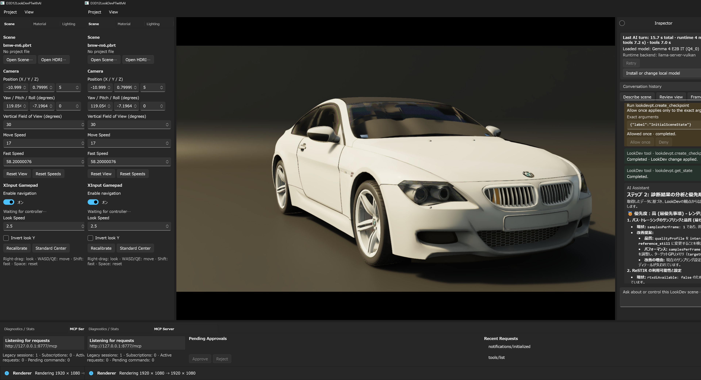

# LLM推論中のレンダリング負荷制御

[English](ai-inference-render-coordination.md)

## 概要

統合AI Assistantでlocal LLMを実行すると、`llama-server.exe`のCUDA / Vulkan backendと
DXR path tracerが同じGPUを同時に使用する場合があります。現在の実装は、Assistantの
1 turn中に画質設定を下げるのではなく、**新しいDXR frameのcommand記録、queue投入、
Presentを一時停止する**方式です。

この制御には次の目的があります。

- local modelへGPU計算資源とmemory bandwidthを譲り、推論中の競合を抑える。
- frameをsubmitしていない間はtemporal parity、jitter、previous matrix、sample countを
  進めず、再開後のhistory対応を壊さない。
- MCP command、scene review、cached snapshot、Native UIは動かし続け、Assistantの
  Tool loopと取消を応答可能なままにする。

これはGPU全体をlockする仕組みではありません。すでにsubmit済みのGPU workを待機せず、
scene load完了時のresource refreshなど一部処理はpause中も実行され得ます。正確には
「steady-stateのviewport frame submissionを止める」実装です。

## 制御区間

pauseはmodel processが実際にtoken生成を開始した瞬間ではなく、Native UIが`sendTurn`を
ChatHostへ正常にqueueした直後に開始します。次の処理を含むturn全体が対象です。

1. local runtime / modelの起動とstatus取得
2. initial inference
3. MCP Toolの実行
4. mutation Toolの一回承認待ち
5. Tool結果を渡したcontinuation inference
6. final responseまたはerrorの受信

したがってCPU backendや、LLMがGPUを使用しない短いturnでも同じpauseが適用されます。
backend、adapter、VRAM使用量を判定して切り替える方式ではなく、動作の予測可能性を優先した
turn単位の保守的なgateです。

## signalの流れ

```text
MainWindow::SendAssistantTurn
  └─ PostAssistantRequest("sendTurn") が成功
       └─ RendererController::SetAssistantInferenceActive(true)
            └─ atomic<bool> release store

RendererController::RenderMain  (renderer thread)
  └─ atomic<bool> acquire load
       └─ D3D12PathTracingBackend::SetAssistantInferenceActive(active)
            ├─ OnUpdate: frame state更新前にpause用経路へreturn
            └─ OnRender: command記録・Execute・Present前にreturn

completed / error / host failure / host stop / window shutdown
  └─ FinishAssistantTurnUi
       └─ RendererController::SetAssistantInferenceActive(false)
```

UI threadとrenderer threadの境界には
[`RendererController`](../Source/WinUI/RendererController.cpp)の
`std::atomic_bool m_assistantInferenceActive`を使います。UI threadはrelease store、
renderer threadは各loopの先頭でacquire loadします。backend内の通常の`bool`はrenderer
threadだけが更新・参照するため、D3D12 objectをUI threadから直接操作しません。

## renderer threadでの動作

### `RendererController::RenderMain`

renderer loopそのものは停止しません。毎loopで次を実行します。

1. Assistant gateとviewport focusをbackendへ反映
2. `RendererCommandQueue`をdrain
3. `OnUpdate()`
4. `OnRender()`
5. 100 ms間隔で`EditorSnapshot`をpublish
6. Assistant turn中は16 ms sleep

最後のsleepは、frame submissionがない状態でrenderer threadがbusy-spinすることを防ぎます。
threadをcondition variableで完全にsleepさせないため、MCP commandとsnapshotはboundedな遅延で
処理できます。

### `D3D12PathTracingBackend::OnUpdate`

pause判定は`OnUpdate()`の冒頭ではなく、次の処理より後にあります。

- pending resize
- async scene loadのpoll
- pending project / scene / environment load
- pending GPU resource refresh
- MCP commandとbenchmark requestの処理

pause中はそこから通常のframe updateへ進まず、`m_lastUpdate`を現在時刻へ更新し、
`ProcessMcpReview()`と`UpdateMcpSnapshots()`を実行してreturnします。

この位置が重要です。MCP Toolやscene auditは止めませんが、pending resource refreshは
GPU workを発生させる可能性があります。そのため、本機能を「推論中はGPU APIを一切呼ばない」
保証として使うことはできません。

通常経路でpauseされる主な処理は次です。

- camera updateとframe deltaの適用
- constant buffer更新とframe-context待機
- temporal jitter、previous/current matrix、frame parityの更新
- progressive sample countとhistory domainの進行
- path tracing、denoise、upscale、tone mapping用commandの記録

### `D3D12PathTracingBackend::OnRender`

`m_assistantInferenceActive`がtrueの場合は関数先頭でreturnします。これにより次を実行しません。

- frame-latency waitable objectの待機
- `PopulateCommandList()`
- `ID3D12CommandQueue::ExecuteCommandLists()`
- swap chain `Present()`
- frame fence signalとframe index / submitted-frame counterの進行
- benchmark frameのcaptureと完了判定

viewportには最後にPresent済みの内容が残ります。WinUIとAssistantは別threadで動くため、
status、streaming text、Tool card、取消操作は利用できます。

## temporal stateを進めない理由

renderを止めても`OnUpdate()`だけ通常実行すると、GPU frameが生成されていないのにCPU側の
history index、jitter、previous matrix、sample blockだけが進みます。再開時に「current」と
「previous」の対応がずれ、TAA / denoise / ReSTIR historyへ不正な入力を渡す原因になります。

現在の実装は、pause中に次を維持します。

- `m_lastUpdate`だけを更新し、再開直後の`deltaSeconds`がturn全体の長さにならないようにする。
- temporal parityとjitterを据え置く。
- submitted frameがないためframe counterとprogressive sample countを進めない。
- pauseだけを理由にhistoryをinvalidateしない。

turn中にMCPやeditor commandがscene、camera、qualityを変更した場合は、そのcommand固有の既存
invalidation規則が適用されます。変更結果の新しいviewport frameはpause解除後に生成されます。

## pause解除と異常系

`FinishAssistantTurnUi()`がrenderer gateの解除を一か所へ集約しています。次の経路から呼ばれます。

- turnの`completed` event（成功またはcancel完了）
- turnの`error` event
- ChatHost bridgeの`Failed` / `Stopped`
- Assistant停止とwindow shutdown

Stop buttonを押した時点では、未確定のmutation結果を誤って「未実行」と扱わないため、すぐに
gateを解除しません。`cancelTurn`を送り、ChatHostからterminal eventを受け取るか、host自体を
停止した時点で解除します。これにより、取消要求後も処理中のToolと最終状態の整合性を保ちます。

## `lookdevpt.get_diagnostics`の短縮経路

graphics gateとは別に、明示的なdiagnostics要求には
[`ChatCoordinator`](../Managed/D3D12LookDevPTwithAI.ChatHost/ChatCoordinator.cs)の
direct Tool経路があります。

user textが`lookdevpt.get_diagnostics`で始まり、「実行」「呼び出し」「取得」または英語の
`run` / `execute` / `call` / `invoke`を含み、否定表現を含まない場合、ChatHostは次の順に
処理します。

1. modelへTool選択を推論させず、read-onlyの`lookdevpt.get_diagnostics`を直接実行
2. Tool結果をconversation contextへ追加
3. Tool callを無効化した1回のinferenceで説明を生成

これにより「最初の推論 → Tool実行 → continuation推論」というround tripを避けます。
Tool自体の実行時間やfinal explanationの生成時間は残るため、0 msになる最適化ではありません。

## turn timingの見方

ChatHostは`completed`と`error` eventへ次の値を追加します。

| Field | 内容 |
|---|---|
| `totalMilliseconds` | runtime、model、Tool、承認待ちを含むturn全体 |
| `runtimeSetupMilliseconds` | runtime status取得、model/server起動を含む準備 |
| `initialInferenceMilliseconds` | Tool結果より前のmodel inference |
| `continuationInferenceMilliseconds` | Tool結果後のmodel inference合計 |
| `toolMilliseconds` | MCP Tool実行時間の合計 |
| `inferenceRounds` / `toolCalls` | 実行round数とTool call数 |

Native UIは`Last AI turn: ... total · runtime ... · model ... · tools ...`として表示します。
これらはAI turnのwall-clock分類であり、rendererのGPU timingではありません。pause期間は概ね
`totalMilliseconds`に対応しますが、UI event配送とrenderer loopがgateを観測するまでの短い差が
あります。



この例では`runtime 4 ms`、`model 7.2 s`、`tools 7.0 s`のように分類されているため、
長いturnを「LLMがすべてthinkingしていた」と判断せず、Tool処理とmodel処理を分けて確認できます。
表示値はcapture時点の一例であり、性能基準値ではありません。

## 現在のtrade-offと制約

- backend非依存のため、CPU inferenceでもrenderをpauseします。
- LLMとrendererが別GPUを使用している場合でもpauseします。
- gate設定時に`WaitForGpu()`は行わないため、直前にsubmit済みのframeとmodel起動が短時間
  overlapする可能性があります。
- boolean gateは同時に1 turnだけという現在のAssistant契約を前提にしています。将来複数turnや
  background inferenceを許可する場合はgeneration IDまたはreference countが必要です。
- pause中もresource refreshやTool処理がGPU workを発生させる可能性があります。
- viewportが静止するため、Toolが変更した見た目をturn途中に確認する用途には向きません。
- dedicated unit testでframe submission回数を検証する仕組みは現時点ではなく、source contractと
  Debug実機確認が中心です。

## 確認手順

1. GPU inference backend（CUDAまたはVulkan）とGPU負荷のあるsceneを用意します。
2. viewportのprogressive sample、camera animation、GPU timingが進んでいることを確認します。
3. Assistantへ長めのpromptを送り、statusがmodel起動またはthinkingへ変わることを確認します。
4. turn中にviewportのsubmitted frameとsample countが進まず、Assistant UIとMCP snapshotは
   更新されることを確認します。
5. normal completion、Stop/cancel、意図的なruntime errorの各経路でrenderが再開することを
   確認します。
6. 再開直後にcameraが大きくjumpせず、TAA / denoise historyにpause由来のparityずれがないことを
   確認します。
7. `lookdevpt.get_diagnostics()を実行して結果を説明して`を送り、Tool timingとmodel timingが
   別表示されることを確認します。

benchmark中にAssistant turnを開始した場合はframe submissionも止まるため、計測対象のrunと
AI turnを重ねないでください。

## 実装箇所

| File | 主な責務 |
|---|---|
| [`Source/WinUI/MainWindow.Assistant.cpp`](../Source/WinUI/MainWindow.Assistant.cpp) | turn開始時のgate設定、全terminal経路での解除、timing表示 |
| [`Source/WinUI/RendererController.h`](../Source/WinUI/RendererController.h) | UI / renderer thread間のatomic flag |
| [`Source/WinUI/RendererController.cpp`](../Source/WinUI/RendererController.cpp) | flag転送、snapshot publish、pause中の16 ms sleep |
| [`Source/D3D12PathTracingBackend.h`](../Source/D3D12PathTracingBackend.h) | renderer-thread localなactive flag |
| [`Source/D3D12PathTracingBackend.cpp`](../Source/D3D12PathTracingBackend.cpp) | `OnUpdate`のtemporal停止経路と`OnRender`のsubmission停止 |
| [`Managed/D3D12LookDevPTwithAI.ChatHost/ChatCoordinator.cs`](../Managed/D3D12LookDevPTwithAI.ChatHost/ChatCoordinator.cs) | direct diagnostics経路とturn timing集計 |
| [`Managed/D3D12LookDevPTwithAI.Chat.Core/PipeProtocol.cs`](../Managed/D3D12LookDevPTwithAI.Chat.Core/PipeProtocol.cs) | completion / error timing fieldのIPC契約 |

## 将来の改善候補

- inference backendとrenderer adapterを照合し、同一GPUの場合だけpauseする。
- 完全pauseではなく、低render scale、低ray budget、frame-rate capを選択できるpolicyを追加する。
- gate transition前後のsubmitted frame serialとGPU fenceをdiagnosticsへ公開する。
- pause時間、抑止frame数、再開latencyをtelemetryではなくlocal diagnosticsへ追加する。
- fake backendまたはsubmission counterを使い、success / cancel / error / host failureの全解除経路を
  自動testする。
