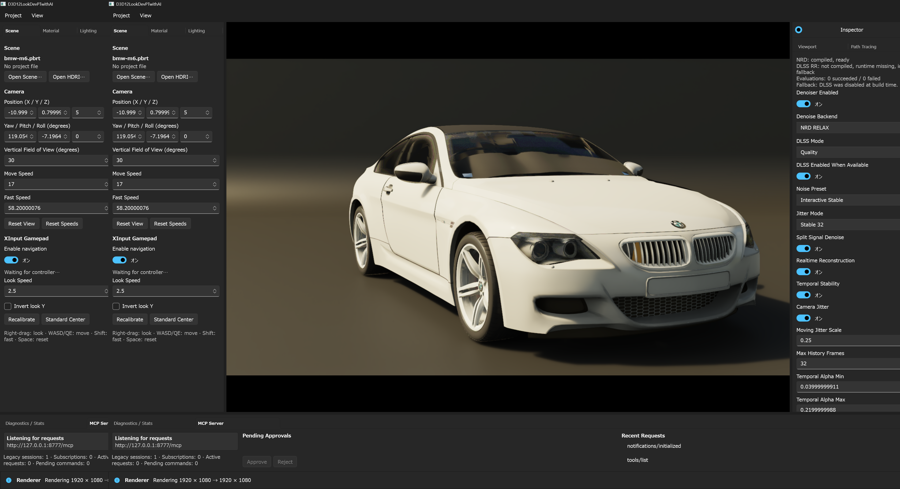

# Denoise UI と fallback 比較

English documentation: [Denoise UI And Fallback Gallery](denoise-ui.md)

このgalleryはDenoise Inspectorの `Denoise Backend` selectorが公開する5種類の値と、
独立した `DLSS Enabled When Available` 設定を示します。下のbackend matrixの全画像は
同じBistro Interiorのcameraと、status blockに表示されたrepository既定backend buildを
使用しています。冒頭の
BMW M6画像はcurrent Inspector全体を示す補助例で、backend matrixの比較対象ではありません。

## 画像より先にstatusを確認する

selectorの項目はrequested backendであり、そのbackendがcurrent frameを生成している証明
ではありません。selectorとstatus blockまたはMCP stateを組み合わせて確認します。

- `denoise.backend` / `denoiser.backend`: requested backend
- `denoise.activeBackend` / `denoiser.activeBackend`: 実効backend
- `denoise.nrd` / `denoise.dlss`: readinessとfallback evidence
- `dlssEnabledWhenAvailable`: 明示的backend選択とは独立して保存するavailability設定
- `Off`: masterの `Denoiser Enabled` がオン表示でもreal-time denoiseを無効化

このBMW M6の画面では`NRD: compiled, ready`と、`DLSS RR: not compiled`およびfallback理由を
同じstatus blockで確認できます。下のtoggleや数値はrequested policyであり、上部statusが
current build/runtimeのavailability evidenceです。

この画像セットではNRDはcompile済み・readyです。DLSS Ray Reconstructionはcompileされず、
runtime / application identityも利用できないため、DLSS-RRを要求するとstatus blockに示す
native fallbackになります。DLSS feature-active認証画像ではなく、fallbackの記録です。

## BackendとDLSS設定のmatrix

| requested backend | `DLSS Enabled When Available`: オン | `DLSS Enabled When Available`: オフ |
|:---|:---:|:---:|
| Internal |  |  |
| NRD REBLUR |  |  |
| NRD RELAX |  |  |
| DLSS Ray Reconstruction |  |  |
| Off |  |  |

## この比較で分かること

- `Internal` はnative temporal / A-Trous reconstruction pathです。
- `NRD REBLUR` と `NRD RELAX` は異なるrequested selectionとして表示され、このbuildで
  利用できます。
- `DLSS Ray Reconstruction` が選択表示のままでも実効backendはfallbackできます。
  理由はstatus textを正として判断します。
- `Off` はreal-time denoiseを行わず、current Monte Carlo varianceを表示します。
- DLSS availability設定を変えてもselectorのrequested backendは非表示・書換えされません。

実装詳細は [NRD](nrd.ja.md)、[DLSS Ray Reconstruction](dlss.ja.md)、
[レンダリングパイプライン](rendering-pipeline.ja.md)を参照してください。
