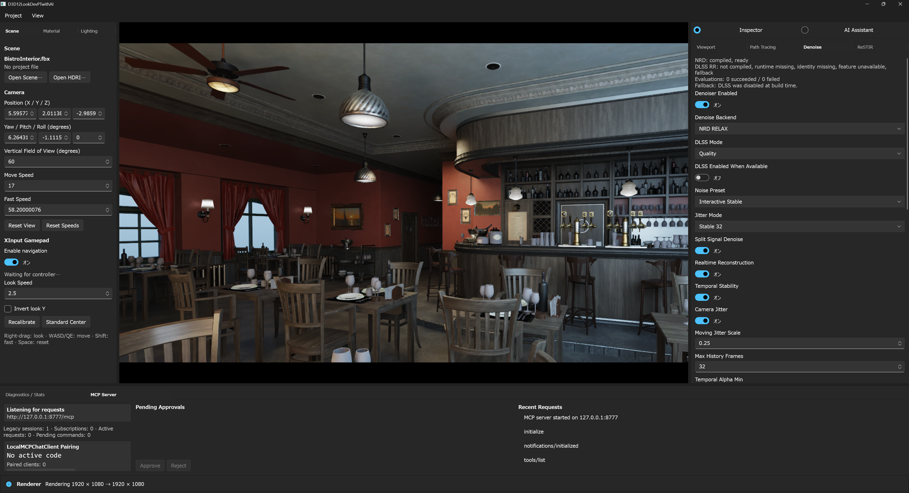
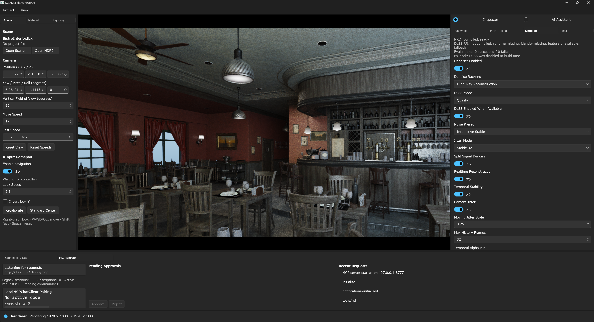
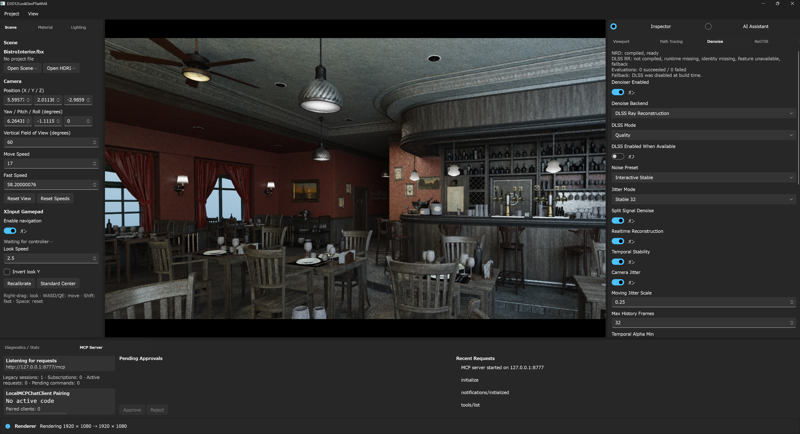
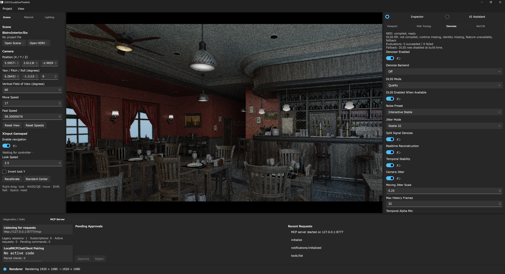

# Denoise UI And Fallback Gallery

Japanese documentation: [Denoise UI と fallback 比較](denoise-ui.ja.md)

This gallery shows the five values exposed by the Denoise Inspector's
`Denoise Backend` selector and the independent `DLSS Enabled When Available`
preference. All captures use the same Bistro Interior camera and the repository
default backend build shown in the status block.

## Read The Status Before The Image

The selected item is the requested backend, not proof that the backend is the
one producing the current frame. Check the status block or MCP state together
with the selector:

- `denoise.backend` / `denoiser.backend` is the requested backend.
- `denoise.activeBackend` / `denoiser.activeBackend` is the effective backend.
- `denoise.nrd` and `denoise.dlss` contain readiness and fallback evidence.
- `dlssEnabledWhenAvailable` stores the separate availability preference; it
  does not replace the explicit backend selection.
- Selecting `Off` disables real-time denoising even when the master
  `Denoiser Enabled` switch remains visible as enabled.

In these captures NRD is compiled and ready. DLSS Ray Reconstruction is not
compiled and its runtime/application identity are unavailable, so requesting
DLSS-RR produces the explicit native fallback shown in the status block. These
images are fallback documentation, not DLSS feature-active certification.

## Backend And DLSS Preference Matrix

| Requested backend | `DLSS Enabled When Available`: on | `DLSS Enabled When Available`: off |
|:---|:---:|:---:|
| Internal |  |  |
| NRD REBLUR |  |  |
| NRD RELAX |  |  |
| DLSS Ray Reconstruction |  |  |
| Off |  |  |

## What The Comparison Demonstrates

- `Internal` is the native temporal and A-Trous reconstruction path.
- `NRD REBLUR` and `NRD RELAX` are visibly distinct requested selections and
  are available in this build.
- `DLSS Ray Reconstruction` can remain selected while the effective backend
  falls back; the status text is the authoritative explanation.
- `Off` exposes current Monte Carlo variance without real-time denoising.
- Changing the DLSS availability preference does not hide or rewrite the
  requested backend in the selector.

For backend implementation details, see [NRD](nrd.md),
[DLSS Ray Reconstruction](dlss.md), and the
[rendering pipeline guide](rendering-pipeline.md).
