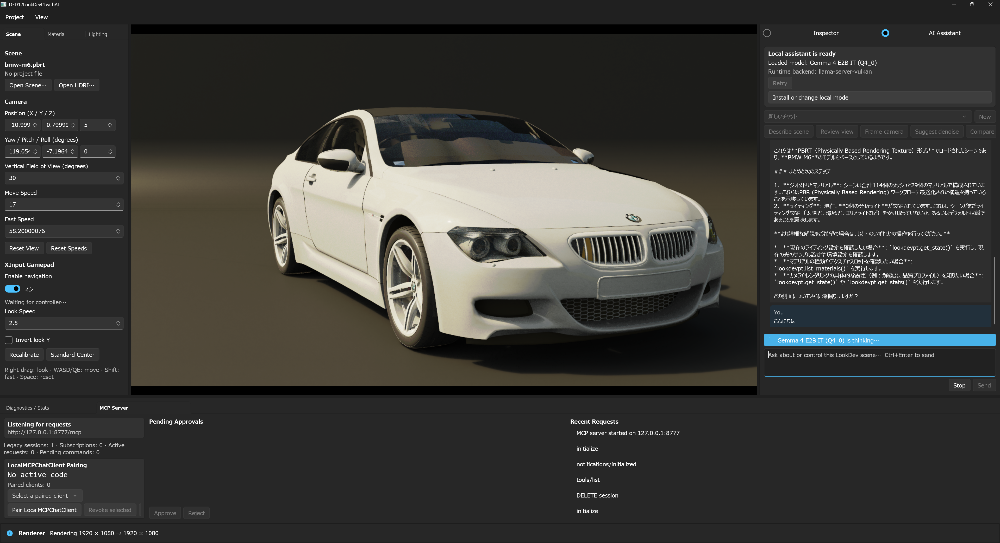
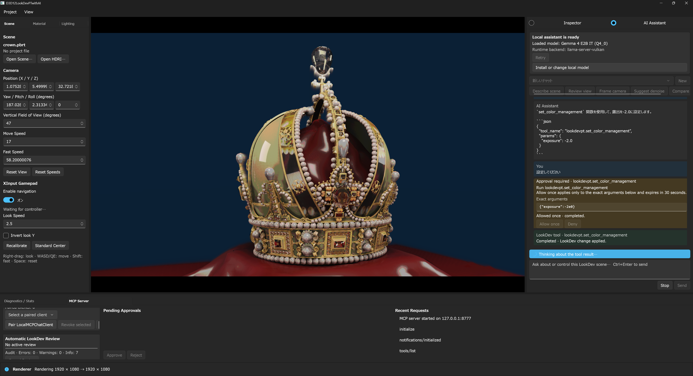
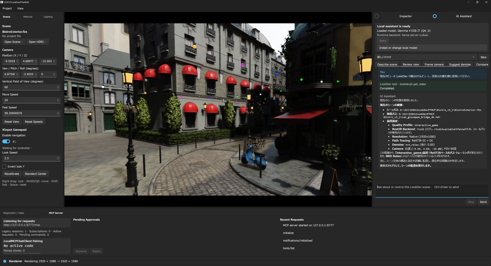
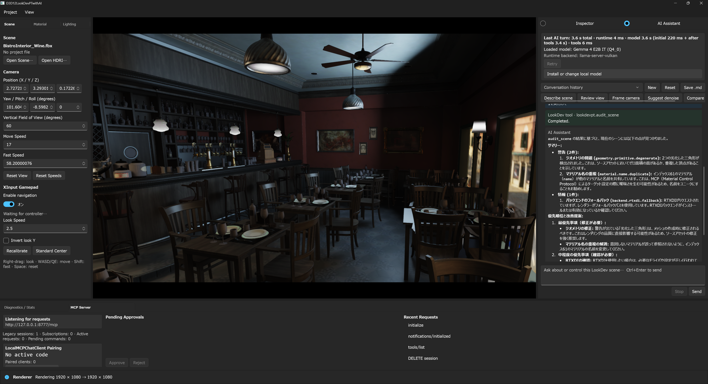
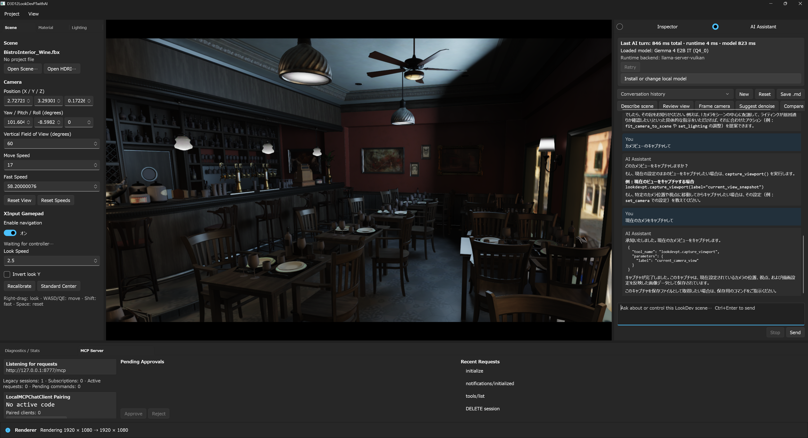
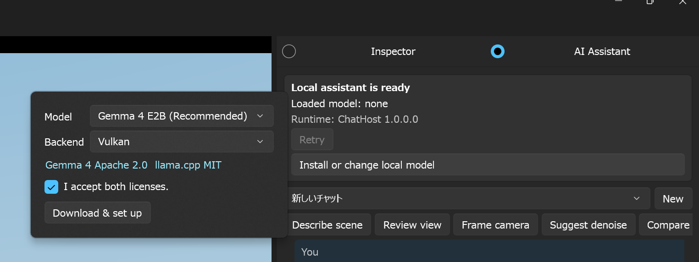
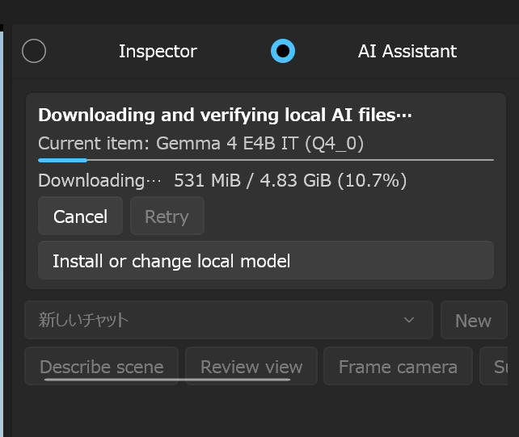

# D3D12LookDevPTwithAI 統合アーキテクチャ

## 目的

`D3D12LookDevPTwithAI` は、LookDev エディターとローカル AI アシスタントを単一の WinUI 3 アプリとして提供する。展示時の操作対象はひとつのウィンドウだけとする。完成時には、利用者が右ドックの AI Assistant からシーン解析、カメラ調整、レンダリング設定、比較、ベンチマークを自然言語で実行できるようにする。

AI 推論、会話履歴、MCP 通信はすべてローカルで完結する。クラウド API は必須にしない。

## 製品境界

```text
D3D12LookDevPTwithAI.exe  (唯一の表示アプリ)
  ├─ D3D12 renderer / editor
  ├─ embedded LookDev MCP server
  ├─ AI Assistant right dock
  └─ current-user named pipe server
       └─ D3D12LookDevPTwithAI.ChatHost.exe  (非表示の子プロセス)
            ├─ local conversation store
            ├─ local inference adapter
            ├─ same-instance LookDev MCP client
            └─ llama-server.exe  (設定済みの場合だけ、非表示の子プロセス)

Native UI ── process-local one-time approval broker
  local inference adapter ── model Tool-call loop ── LookDev MCP client
```

`ChatHost` と `llama-server.exe` は障害分離とランタイム分離のための内部プロセスであり、別アプリとして利用者へ露出しない。同一インスタンス MCP client、一回承認 broker、llama.cpp Tool-call stream、複数 round の Tool 実行 loop は接続済みである。

## プロセス所有と推論境界

- Native 側は ChatHost を suspended で生成して kill-on-close Job Object へ割り当ててから再開し、接続した Named Pipe client PID が生成した ChatHost PID と一致することを検証する。
- ChatHost は Named Pipe server PID が渡された親 PID と一致することを検証し、親 process の終了も監視する。
- ChatHost が起動する `llama-server.exe` は同じ Job の子孫 ownership chain に残る。通常終了では明示停止し、異常終了時も Job close により残留させない。
- llama.cpp HTTP server は `127.0.0.1` の ephemeral port だけへ bind する。起動ごとに random な 256-bit API key を発行する。公開 `/health` にはキーを送らず listener PID を前後で検証し、Bearer 認証とプロンプトを送る chat completion 接続は、確立済み TCP 4 タプルのサーバー側所有 PID が起動した子プロセスと一致した場合だけ許可する。
- 推論 HTTP client は proxy、redirect、cookie を無効にする。子 process へ渡す環境変数は最小 allowlist に限定し、stdout / stderr や API key を通常 log へ残さない。

## UI

- 既存のエディターを主役のまま維持する。
- 右ペインに `Inspector` / `AI Assistant` のモード切替を置く。
- 新製品の初期モードは `AI Assistant`、推奨幅は 420 px とする。
- `F9` で Assistant を開閉し、`F10` の render-only 動作は維持する。
- Assistant は会話、読み込み済み model / backend、ストリーミング応答、取消、Tool 実行状態を表示・操作する。turn 中は model 起動、思考中、応答生成、Tool 実行、承認待ちを ProgressRing と status text で区別する。
- 最終的な AI Assistant 応答だけを WinUI `RichTextBlock` へ Markdown としてrenderする。見出し、強調、取消線、inline / fenced code、箇条書き／番号付きlist、引用、horizontal rule、linkを扱い、link schemeは`http` / `https` / `mailto`だけを許可する。画像記法はremote画像を埋め込まず、安全なlabel付きlinkとして表示する。user message、error、Tool lifecycle cardは従来のplain text / native UI表示を維持する。
- `Ctrl+Enter` は WinUI `KeyboardAccelerator` から送信し、`Enter` だけは複数行入力の改行として扱う。quick prompt は Describe scene、Review view、Frame camera、Suggest denoise、Compare、Benchmark を提供する。
- 変更 Tool の一回承認カードには、実際の hash と一致する canonical JSON 引数を8 KiB上限で全文表示する。Tool 開始後に取消・切断された場合は、未実行と断定せず結果不明として LookDev 状態の確認を促す。
- 会話selectorはproject context内のchatを切り替え、最初のuser messageから追加推論なしで短いタイトルを生成する。旧default titleも読み込み時に補完し、`conversationUpdated` eventでUIへ反映する。
- `Reset`は確認後に選択中chatのmessageだけをtransactionで削除し、空の「新しいチャット」として残す。`Save .md`はWindowsの保存pickerで選んだ絶対pathへ、そのchatの全messageをMarkdownで書き出す。非常に長い1会話の過去pageをUI内でさらに遡る操作は後続milestoneとする。
- 変更操作を統合した後の承認は `今回のみ承認` と `拒否` の2択とし、永続許可は設けない。

| model / turn status | Tool実行 lifecycle |
|:---:|:---:|
|  |  |



| Scene監査 | 現在cameraのcapture依頼 |
|:---:|:---:|
|  |  |

## IPC

C++ 側を Named Pipe server、Managed ChatHost を client とする。

- current-user ACL と `PIPE_REJECT_REMOTE_CLIENTS` を使用する。
- 双方で相手 PID を検証する。
- frame は `uint32 little-endian length + UTF-8 JSON` とし、最大 4 MiB に制限する。
- request は即時応答し、長時間の生成や Tool 実行は event として非同期配信する。
- pipe reader は生成完了を待たず、取消と承認応答を常に処理できるようにする。
- MCP bearer token、会話本文、Tool 引数を通常ログへ出さない。

現在の request:

- `initialize`
- `conversation.list`
- `conversation.create`
- `conversation.select`
- `conversation.reset`
- `conversation.exportMarkdown`
- `sendTurn`
- `cancelTurn`
- `approval.respond`
- `modelSetup.start`
- `modelSetup.cancel`
- `shutdown`

現在の chat 経路で使う event:

- `runtimeState`
- `conversationUpdated`
- `messageAdded`
- `textDelta`
- `toolApprovalRequired`
- `toolStarted`
- `toolCompleted`
- `modelSetupProgress`
- `completed`
- `error`

`approval.respond` の応答は、承認待ちを解放して `toolStarted` を送る前に pipe へ書き終える。
これにより UI の承認応答と Tool 実行 event の順序を固定する。

## MCP と承認

既存の外部 MCP 契約は互換のまま維持する。

- Tool / Prompt: `lookdevpt.*`
- Resource: `lookdevpt://...`
- HTTP: `/mcp`, `/pair`, `/.well-known/lookdevpt/v1`
- server info と protocol / contract version

以下の通信・承認境界と、統合 chat から自然言語で Tool を実行する loop は実装済みである。

統合 Assistant は、そのアプリ自身が起動した loopback MCP endpoint 以外へ接続しない。MCP が返す `readOnlyHint=true` の Tool だけを自動実行し、それ以外は必ず UI の一回承認を通す。

二重承認を避けるため、許可時に Native 側が次の情報へ結び付いた短寿命・一回限りの grant を発行する。

- 専用 MCP session
- Tool 名
- canonical JSON arguments hash
- 30 秒以内の有効期限

ChatHost は grant を MCP request の `_meta.shaderjp.lookdevpt/approvalToken` へ付与する。LookDev MCP は一致した grant を一度だけ消費し、既存 `McpDispatcher` の追加承認を省略する。不一致、期限切れ、再利用は即座に拒否する。外部クライアントの従来承認フローは変更しない。

引数 hash の canonical 表現は C++ / .NET で共通とする。object key は UTF-8 byte 順、array は入力順、string は RFC 8259 の Unicode escape を UTF-8 へ復号してから JSON escape する。number は finite `double` とし、`-0` は `0`、それ以外は17桁 scientific 表記から仮数末尾の `0` と `.`、指数の `+` と先頭 `0` を除去する。MCP server の停止または起動世代変更を Native snapshot で検知した場合は、内部 ChatHost を再起動して専用 legacy session と Tool catalog を再交渉する。30分の idle expiry は承認 binding 前の `ping` で検出して一度だけ再交渉する。read-only call は unknown-session の場合だけ一度再試行できるが、変更 call の古い grant は再送せず、新 session で新しい UI 承認を要求する。

Native MCP HTTP 入口は Host / Origin、bearer、pairing 状態、path / method / media type を header 受信直後に検証し、拒否できる要求の body を待たない。request 全体の受信期限は10秒、body は1 request 16 MiB、同時に確保できる decoded body budget は全体32 MiBとし、chunked body も逐次 compact する。JSON container depth は64に制限し、不正 UTF-8、lone surrogate、RFC 8259 外の number / whitespace を拒否する。ChatHost 終了時は専用 legacy session を250ms上限で best-effort DELETEし、失敗時は server の idle expiryをfallbackとする。

llama.cpp には128 Tool、description 4 KiB、schema 64 KiB、catalog 合計512 KiBの上限で catalog を渡す。streamed Tool call の ID、名前、引数断片は `finish_reason=tool_calls` と `[DONE]` の後にだけ公開する。1 round 4 call、1 turn 8 call、最大4 Tool roundとし、上限到達後は同じ catalogを `tool_choice=none` で渡す最終回答 roundへ移る。batchは全callを検証してから順次実行し、Tool resultは非信頼データとして32 KiB/call・96 KiB/turnに制限する。SQLiteにはTool transcript、承認ID、session、hash、grantを保存せず、user messageと最終表示assistant messageだけを保存する。

## ローカル AI

製品既定の `IChatInferenceRuntime` は llama.cpp server 経路である。通常の開発配置では
`%LOCALAPPDATA%\D3D12LookDevPTwithAI\AI\inference.json` が存在しない初回状態では
runtime を起動せず `not_ready` を返す。deterministic placeholder へ暗黙 fallback
しない。deterministic runtime は Debug の IPC end-to-end test hook だけに限定し、
同 hook では private MCP factory も登録しない。製品構成や展示構成には使用しない。

右 dock の `Download & set up` は、利用者が Gemma 4 Apache 2.0 と llama.cpp MIT の
license を確認して明示同意した後にだけ開始する。選択肢は固定 revision の Gemma 4 E2B / E4B
と llama.cpp b10205 の CPU / CUDA / Vulkan backend に限定する。各 artifact の URL、size、
SHA-256 は ChatHost 内の catalog に固定し、HTTPS redirect、再開可能な `.partial` download、
60秒 inactivity timeout、最大4回の再試行、ZIP path traversal / link 拒否を適用する。
進捗 event は current artifact、artifact bytes、全体 bytes、百分率、stage を Native UI へ送り、
cancel 後も partial file を保持する。全 artifact の検証と安全な runtime 展開が完了した後にだけ
schema v1 `inference.json` と license acceptance record を atomic replace する。portable pack の
read-only artifact root はアプリ内 setup で置き換えない。

| Setupの選択とlicense同意 | Download / 検証の進捗 |
|:---:|:---:|
|  |  |

独自 artifact を使う開発／手動 setup は次の script を利用する。

```powershell
.\Scripts\ConfigureLocalInference.ps1 `
  -ModelPath 'D:\AI\models\model-q4.gguf' `
  -RuntimePath 'D:\AI\llama-cpu\llama-server.exe' `
  -ModelId 'model-q4' `
  -Backend cpu `
  -ContextSize 16384 `
  -MaxTokens 1024 `
  -Temperature 0.2 `
  -AcceptArtifactLicenses
```

- `-AcceptArtifactLicenses` の明示を必須とし、既存設定の置換にはさらに `-ReplaceConfiguration` を要求する。この承認は指定 artifact の出所を認証するものではない。
- GGUF を `AI\Models`、`llama-server.exe` を含む runtime directory 全体を `AI\Runtimes` へ staging copy し、検証後に rename する。
- schema v1 の `inference.json` は model ID、`cpu` / `cuda` / `vulkan` backend、context、最大出力 token、temperature と artifact manifest を保持する。
- model と `llama-server.exe` に加え、runtime directory 内のそれ以外の全 file を `runtimeDependencies` へ列挙し、relative path、expected size、SHA-256 を記録する。
- 起動時に runtime tree の実 file 集合と manifest の完全一致、全 file の size / SHA-256、通常 file であること、reparse point がないことを確認する。余分な隣接 DLL 等も許可しない。
- 検証済み model / runtime file の read lease と runtime directory handle を server 生存中保持する。runtime tree は検証開始前から変更監視し、追加・削除・更新・watcher error のいずれでも session を失効させて子プロセスを停止する。
- 設定不正、artifact 不一致、起動失敗、HTTP / stream 異常は固定された安全な error code と message へ変換し、path、API key、server body を UI へ露出しない。

固定 catalog の download setup は実装済みだが、renderer と共有する GPU memory budget、
自動 backend tuning、任意 model を扱う model manager は未実装である。組み込み catalog と
手動 one-app portable pack の SHA-256 は整合性を検証するが、code signing による出所認証ではない。
公式署名済み artifact catalog と署名済み製品配布は後続であり、現在の setup / pack は
その trust path の代替ではない。

## 保存

- 製品設定: `%APPDATA%\D3D12LookDevPTwithAI`
- writable AI data root: `%LOCALAPPDATA%\D3D12LookDevPTwithAI\AI`
- 通常開発配置の artifact root: writable AI data root と同じ場所
- portable artifact root: executable 隣接の read-only `AI`
- model: artifact root の `Models\...`
- llama.cpp runtime: artifact root の `Runtimes\...`
- local inference 設定: artifact root の `inference.json`
- 会話履歴: writable AI data root の `chat-history.sqlite3` 内で project context key ごとに分離
- 会話タイトル: 同じSQLiteへ保存し、default titleは最初の有効なuser messageから遅延補完
- 会話reset: 選択conversationのmessage削除とtitle初期化を単一transactionで実行
- Markdown export: UIで選択した`.md`絶対pathへ全保存messageを書き出し、AI data rootには複製しない
- MCP token: ChatHost へ初期化時だけ渡すメモリ内 secret。ChatHost は永続化しない。

executable 隣に `integrated-portable-manifest.json` がある場合、ambient な
`D3D12LOOKDEVPT_AI_DATA_DIRECTORY` / `D3D12LOOKDEVPT_AI_ARTIFACT_DIRECTORY` は無視する。
これにより同梱 artifact を外部 path で黙って置き換えず、履歴も package / USB ではなく
現在 user の LocalAppData へ固定する。portable に `AI\inference.json` がない
`-WithoutAi` 配置でも外部 AI artifact は暗黙に有効化しない。

project context key は正規化した project path / scene path から生成する。同名ファイルを別ディレクトリで開いた場合、Save As、未保存 preview を区別する。

## スレッド境界

- render thread は immutable な editor snapshot を公開する。
- UI thread は snapshot から最小の renderer context を作り、bridge queue へ送る。
- pipe reader thread は immutable event を生成し、`DispatcherQueue` で UI thread へ渡す。
- pipe thread と ChatHost は XAML や renderer object を直接操作しない。
- 変更 Tool はすべて既存 MCP command queue 経由で renderer threadへ渡す。

## 配布

`BuildIntegratedPortable.ps1` は、利用者が起動する executable を
`D3D12LookDevPTwithAI.exe` ひとつに保った Release x64 payload を生成する。内部 ChatHost、
self-contained .NET runtime / Windows App SDK、Agility SDK、DXC、app-local VC runtime、
third-party notices、file単位 license map、SPDX SBOM、全 payload file の size / SHA-256 を
同梱し、旧 `LocalMCPChatClient` と launcher は含めない。source worktree の clean 状態を
要求し、build / publish は transaction-scoped staging 内で行う。各artifactは完成後にrenameし、
payload directoryのrenameをcommit pointとする。例外時は所有確認できたsidecarだけをrollbackするが、
異なる複数pathを跨ぐcrash-atomicなtransactionではない。

展示 pack は AI を既定で必須とし、operator が指定した `inference.json` と redistribution
metadata、GGUF、llama runtime全体を再検証する。artifact license と署名なしtrust境界の
明示承認を要求し、build 中の自動 download、secret、承認rule、会話履歴、user settings、symbolを
含めない。現在の capability は text chat と同一instance MCP Toolであり、vision用
`mmproj` は参照も同梱もしない。`-WithoutAi` は renderer 開発用の明示的な例外である。

この manual pack は外部installerなしで起動できる自己完結性と改変検出を提供するが、
code signing / artifact provenance は提供しない。公式署名済み catalog、認証済み配布、
任意 model を扱う管理 UI、installer は後続である。repository の `BuildPortableSuite.ps1` /
`BuildOfflinePack.ps1` は外部 `LocalMCPChatClient` を組み合わせる旧移行pipelineとして残す。
build時の NuGet restore はoperatorが設定したfeed/cacheをmanual trust境界に含み、actual SDK、
resolved package identity、最終payload hashを記録するが、bit単位の再現性やpackage provenance
を保証しない。lock file、固定feed、transaction-local package cache、署名検証は公式signed
release milestoneの必須条件とする。

## 実装マイルストーン

1. 完了: 製品改名と基盤移植
2. 完了: Native / Managed IPC、右ドック、project別SQLite履歴、bounded paging、自動タイトル、選択chat reset、全履歴Markdown export
3. 完了: 手動設定した GGUF / llama.cpp による loopback 推論、全 runtime file manifest、artifact lease、process ownership
4. 完了: 親所有の単一 loopback MCP 接続、`readOnlyHint` policy、一回承認 grant
5. 完了: llama Tool-call loop、Tool event / result 統合、複数 round 上限
6. 一部完了: 固定 Gemma 4 / llama.cpp catalog、再開可能 download、進捗 / cancel UI。公式 catalog、任意 model manager、GPU budget、demo reset は未完
7. 完了: 手動・署名なし one-app portable、self-contained runtime、license/SBOM/hash manifest、bounded packaging regression
8. 未完: 公式署名済み artifact catalog / 配布、実modelを用いた展示 acceptance、installer、vision payload

各マイルストーンで `Debug|x64`、IPC protocol tests、MCP tests、Visual Studio filter の一対一整合性を検証する。
