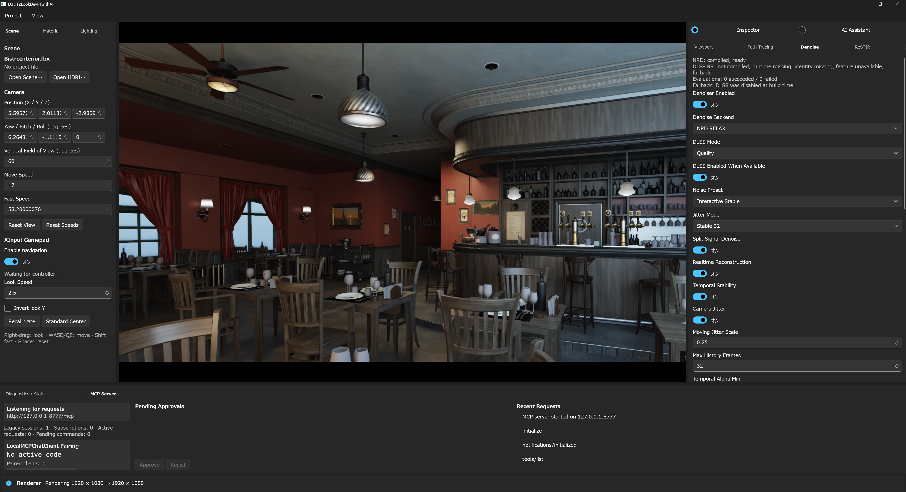

# NVIDIA NRD optional backend

English documentation: [Optional NVIDIA NRD Backend](nrd.md)

D3D12LookDevPTwithAI は NVIDIA Real-Time Denoisers を optional な D3D12 compute backend として統合しています。repository は NRD `v4.17.3`（`792eff196afdd350fd9c3f862119017ccb438a0e`）へ固定しています。`interactive_game` は REBLUR、`sharp_preview` は RELAX を選択し、`reference_still` は NRD と temporal post-process を無効にします。NRD を利用できない場合、interactive profile は要求された選択を保持しつつ、internal temporal / A-Trous fallback で描画します。

## セットアップ

固定した SDK と依存関係を初期化します。

```powershell
git submodule update --init --recursive ThirdParty/NRD
git -C ThirdParty/NRD describe --tags --always
```

2 つ目の command は `v4.17.3` を返す必要があります。`BuildThirdParty.ps1` は `NRD.lib`、生成済み DXIL shader blob、`ShaderMakeBlob.lib` を次へ build します。

```text
ThirdParty/NRD/Build/<toolset>/x64/<Config>/Lib/
```

NRD を実行する machine では strict setup check を使います。

```powershell
.\Scripts\CheckSetup.ps1 -CheckNRD
```

repositoryでサポートする統合check / buildではmanifest駆動profileを使用します。固定revisionと
生成library pathも検証します。

```powershell
.\Scripts\SetupNvidiaEnvironment.ps1 -Profile RepositoryDefault -Configuration Release -Build
```

DLSS / RTXDIと同時に有効化する場合やcheckout外のSDK rootを使う場合は
[NVIDIA開発・Release setup](nvidia-setup.ja.md)を参照してください。

## Build switch と matrix

NRD は compile 時に default で有効です。依存を持たない backend build では無効化できます。

```powershell
msbuild .\D3D12LookDevPTwithAI.sln /m /p:Configuration=Release /p:Platform=x64 /p:EnableNRD=false
```

`EnableNRD=false` は SDK header / library を除外し、全 shader 構成を build 可能なまま維持し、`compiled=false` を公開して NRD 選択を internal backend へ route します。RTXDI と DLSS は独立した switch です。

repositoryにはall-enabled、各backendを1つずつ無効化、all-disabled、現在のmanifest定義
target構成（`NRD=true`、`RTXDI=false`、`DLSS=false`）をbuild / launchするmatrixがあります。

```powershell
.\Scripts\BuildBackendMatrix.ps1 -Configuration Release
```

compile だけを確認する場合は `-SkipLaunch` を追加します。

## Signal と guide の契約

path tracer は denoise 前に 3 つの linear HDR signal を出力します。

- demodulate 済み diffuse radiance と、実際の最初の diffuse-secondary hit distance
- demodulate 済み specular radiance と、実際の最初の specular-secondary hit distance
- emission、sky、remodulation 用 material metadata を含む filter しない residual energy

現在の `NrdPrepareCS` は、これらの signal と `SurfaceGuides` を公式 NRD resource 契約へ変換します。この prepare dispatch はまだ削除していません。private pack ではなく `NRD.hlsli` の helper を使用します。

| NRD input | Renderer source / format |
|---|---|
| Motion | 2.5D の `previousUV - currentUV` と `previousViewZ - currentViewZ`、`R16G16B16A16_FLOAT` |
| Normal + roughness | world-space normal と linear roughness、公式 encoding 2、`R10G10B10A2_UNORM` |
| View-Z | 正の linear view-Z、`R32_FLOAT` |
| Diffuse / specular radiance + hit distance | 公式 REBLUR / RELAX pack、lobe ごとの `R16G16B16A16_FLOAT` |
| Diffuse / specular confidence | 検証済み reprojection と lobe sample confidence、lobe ごとの `R8_UNORM` |

current / previous jitter と view / projection matrix は NRD へ個別に渡します。motion に jitter は焼き込まず、SDK が両方の jitter 値を受け取ります。primary miss は範囲外 View-Z convention と lobe hit distance 0 を使います。有効な primary hit の後で sample 済み secondary ray が miss した場合、その lobe には設定済み ray range を保存し、0 は未 sample または adaptive に skip した secondary lobe を表します。

## 実行 graph

NRD と Final TAA を有効にした通常の final beauty path は次の graph です。

```text
Split lighting signals
  -> NrdPrepareCS
  -> NRD REBLUR/RELAX dispatches
  -> FinalTaaCS (NRD remodulation + composite + HDR TAA + sharpen)
  -> tone-mapped output
```

`FinalTaaCS` は denoise 済み Diffuse / Specular lobe を直接読み、NRD material factor を適用し、residual signal を加えて HDR history を resolve します。通常 graph から standalone の `NrdCompositeCS` dispatch と full-resolution post-denoise intermediate を除去しています。

Final TAA が無効、final 以外の debug / validation view、quality benchmark が intermediate を必要とする場合は、明示的な composite path を残します。`reference_still` でも fusion は無効です。この最適化が融合するのは Composite と Final TAA です。`NrdPrepareCS` の削除や NRD の低解像度実行はまだ行っていません。

## 実行時の選択と fallback

Denoise panel と `lookdevpt.set_denoise` は次を受け付けます。

- `internal`: Diffuse / Specular を分離した temporal history と hit-distance-aware A-Trous
- `nrd_reblur`: `REBLUR_DIFFUSE_SPECULAR`
- `nrd_relax`: `RELAX_DIFFUSE_SPECULAR`
- `dlss_rr`: 別系統のDLSS-RR evaluation path。readyでない場合はnative reconstructionへfallback
- `off`: real-time denoiser なし

| NRD REBLUR | NRD RELAX |
|:---:|:---:|
|  |  |

Denoise Inspectorは要求したbackendを表示し、上部status blockがNRDのcompile / ready状態を
報告します。REBLURはinteractiveの既定、RELAXはsharp preview向けの選択です。

[Denoise UIとfallback比較](denoise-ui.ja.md)では、DLSS availability設定を明示したまま、
これらとInternal、DLSS Ray Reconstruction、Offを比較できます。

例:

```json
{
  "method": "set_denoise",
  "params": {
    "backend": "nrd_reblur",
    "resetNrd": true
  }
}
```

bridge は選択した NRD instance、permanent / transient pool、compute pipeline、3 frame context 分の descriptor / constant-buffer ring を作成します。descriptor layout は method、resolution、frame context、dispatch ごとに cache し、resource binding が変わった slot だけを書き換えます。

SDK、method、resource format、pipeline、evaluation のいずれかが利用できない場合、UI は要求された NRD 選択を表示したまま、実効 backend `internal` と正確な fallback 理由を公開します。実行中の evaluation failure では backend resource rebuild を queue してから internal fallback を使います。同一 frame で一部だけ書かれた NRD resource を internal history として再解釈しません。

状態は `lookdevpt.get_state` または `lookdevpt.get_stats` の `denoise.nrd` / `denoiser.nrd` で取得できます。主な field は `compiled`、`evaluationReady`、SDK version、selected denoiser、resource resolution、pool count、encoding 名、`lastError`、`fallbackReason` です。

status行は、compile済みでreadyなbackend、現在選択中のbackend、実効fallbackを区別します。
checked-in galleryではNRDはreadyですが、DLSS Ray Reconstructionはbuildで利用できず、
rendererがfallback理由を明示しています。

## History と resource の挙動

- Surface guide と identity は frame parity で選択する immutable A/B descriptor table を使います。full-resolution の end-of-frame guide copy はありません。
- 通常の camera motion は Surface、Lighting、NRD、TAA history を維持します。camera cut、projection 変更、resize は reset します。material / light / HDRI 編集では有効な surface guide を維持しつつ Lighting / NRD / TAA history を reset します。
- 選択中の real-time backend だけが backend 固有の full-resolution resource set を持ちます。未使用 backend 専用 resource は descriptor-valid な 1x1 placeholder です。NRD と internal の lobe resource は排他的で、可能な範囲で同じ allocation family を再利用します。
- `reference_still` は Baseline MIS accumulation を使用し、final output に NRD、TAA、RTXDI、contribution compression を適用しません。

## 検証

filter 強度を調整する前に NRD validation / debug view で normal、roughness、linear View-Z、2.5D motion、confidence / disocclusion、Diffuse / Specular の input / output、非有限 pixel を確認してください。performance benchmark は full-screen quality-counter pass を省略します。quality / combined benchmark はこれを実行し、capture する intermediate を明確にするため明示的な NRD composite path も維持します。

NRD は統合済みで実行可能ですが、1080p60 の品質・性能目標は scene と camera path ごとの追加検証が必要です。backend が利用可能であることは、全 scene が最終的な blur、ghosting、frame-time gate を満たす証明ではありません。
