# D3D12LookDevPTwithAI レンダリングパイプライン学習ガイド

English documentation: [Rendering Pipeline Learning Guide](rendering-pipeline.md)

この文書は、リアルタイムレンダリングやパストレーシングを学ぶ人が、D3D12LookDevPTwithAI の「1 frame がどのように画像になるか」を実装と対応付けて読めるようにしたガイドです。アルゴリズムの一般論だけでなく、現在の repository に実装されている処理、optional backend、fallback、まだ実装されていない機能を区別して説明します。

最初に全体像を読み、次に興味のある段階を Debug View で観察し、最後にリンクした shader を読む順番がおすすめです。

> [!NOTE]
> この文書は「目標アーキテクチャ」ではなく現在の実装を説明します。条件を満たす DXR 1.1 Interactive Baseline/DI frame は独立 Primary Visibility と compact secondary task graph を使い、RTXDI GI/PT、Reference Still、DXR 1.0、diagnostic run は megakernel を維持します。RTXDI は DI/GI/checkerboard PT、DLSS Ray Reconstruction は frame ごとの tag/evaluation まで実装済みです。

## 1. 2種類の出力目標

D3D12LookDevPTwithAI は、目的の違う2つの描画経路を分けています。

| 経路 | 目的 | 主な考え方 |
|---|---|---|
| Interactive | 1080pで操作中も安定したゲーム品質を目指す | 少ない ray を時間方向に再利用し、多少の bias を許容してノイズとちらつきを抑える |
| Reference Still | 材質や照明を比較する高SPP基準画像 | ReSTIR、寄与圧縮、denoiser、Final TAAを外し、Baseline MISを長時間蓄積する |

Interactive の画像が Reference より速く安定するのは、過去 frame、近傍 pixel、denoiser の事前知識を利用するからです。一方で Reference Still は時間的な安定化より、推定器を単純に保ち多くの sample で収束させることを優先します。

## 2. 1 frame の全体像

通常の Interactive Beauty は、host側の [`D3D12PathTracingBackend::PopulateCommandList`](../Source/D3D12PathTracingBackend.cpp) に従って次の順序で実行されます。

```mermaid
flowchart LR
    FS["FrameState / camera / jitter / history validity"] --> W{"Compact secondary<br/>eligible?"}
    W -->|"yes"| PV["Primary Visibility<br/>完全な guide と ID"]
    PV --> CW["SPP prefix scan<br/>SecondaryTask list"]
    CW --> SI["1D ExecuteIndirect<br/>secondary task + resolve"]
    W -->|"no"| PT["DXR megakernel<br/>path tracing + first-hit guides"]
    SI --> G
    PT --> G["Surface guides<br/>normal, view-Z, motion, identity"]
    SI --> S
    PT --> S["Lighting signals<br/>diffuse, specular, residual"]
    G --> R{"RTXDI ReSTIR DI<br/>active?"}
    S --> R
    R -->|"yes"| RA["Pass A<br/>candidate + temporal"]
    RA --> RB["Pass B<br/>spatial + visibility + shade"]
    RB --> GI["Optional RTXDI GI / PT<br/>initial + fused reuse/shading"]
    R -->|"no"| GI
    GI --> D{"Reconstruction"}
    D -->|"NRD"| N["NrdPrepareCS<br/>REBLUR / RELAX"]
    D -->|"Internal"| I["Temporal + moments<br/>hit-distance-aware A-Trous"]
    D -->|"Off"| O["Current HDR"]
    D -->|"DLSS-RR"| DL["Guide prepare + tag<br/>slEvaluateFeature"]
    N --> T["FinalTaaCS<br/>HDR TAA/TAAU + sharpen"]
    I --> T
    O --> T
    DL --> TM
    T --> TM["Exposure + None / Reinhard / ACES fitted<br/>gamma encoding"]
    TM --> P["Swapchain copy + WinUI composition + Present"]
```

実際の command list の順序は次の通りです。

1. `DispatchRays`、または Primary Visibility + compact task generation + 1D `ExecuteIndirect` + pixel resolve
2. `RunRestirReusePass`
3. 選択 indirect algorithm の `RunRestirGiPass` / `RunRestirPtPass`
4. `RunDenoisePass`。DLSS-RR が選択され ready の場合は prepare/evaluation も含む
5. native reconstruction の `RunFinalTaaPass`。DLSS-RR 成功時は bypass
6. 通常実行とcombined / quality benchmarkでは `RunQualityCounterPass`。performance benchmark時だけ省略
7. `SealSurfaceGuideFrame`
8. `CopyOutputToBackBuffer`
9. WinUI の swap-chain panel 経由で Present。Render Only Mode では editor chrome を非表示

Tone mapping は概念上の最終段ですが、通常は `FinalTaaCS` の末尾で出力されます。Final TAAを使わない経路では、RayGenまたはdenoiser compositeが同じ表示変換を行います。

Reference Still は別の短い経路です。

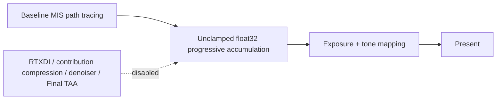

## 3. Scene から DXR traversal まで

### 3.1 Scene import とGPU resource

Assimpで読み込んだstatic meshは、vertex/index buffer、geometry record、material buffer、texture tableへ変換されます。materialはbase color、normal、roughness、metallic、occlusion、emissive、alpha maskを持ちます。

DXRでは次の acceleration structure を使います。

- BLAS: mesh geometry の三角形を探索する構造
- TLAS: instance と BLAS をまとめてscene全体を探索する構造

非alpha geometryには `D3D12_RAYTRACING_GEOMETRY_FLAG_OPAQUE` を付け、不要な AnyHit 呼び出しを避けます。alpha maskが変わる編集では、geometry flagも変わるためBLASを更新します。static BLAS は compaction を要求して post-build compacted size を取得し、TLAS 構築前に compact copy し、初期化後に元 result/scratch を解放します。

### 3.2 Shader stage と小さい payload

DXR pass の主なshaderは [`PathTracingABI.hlsli`](../Shaders/PathTracingABI.hlsli) にあります。

| Shader | 役割 |
|---|---|
| `RayGen` | pixelごとのcamera ray生成、path loop、material/BSDF評価、AOVとsignal出力 |
| `Miss` | geometryに当たらなかったことを返す |
| `ClosestHit` | hit距離、barycentric、instance/geometry/primitive IDだけをpayloadへ格納 |
| `AnyHit` | alpha mask texelを調べ、透明なら `IgnoreHit` |
| `ShadowMiss` / `ShadowAnyHit` | visibility ray用の軽量shader |

path payloadは32 byte、shadow payloadは12 byteです。ClosestHitでmaterial textureまで評価すると、その状態を大きなpayloadに載せる必要があります。この実装ではintersection情報だけを返し、RayGenで一度だけmaterialを評価して、ray traversal中のregister pressureとmemory trafficを抑えます。

## 4. 1 pixel の path tracing

1 sampleの概念的な流れは次の通りです。

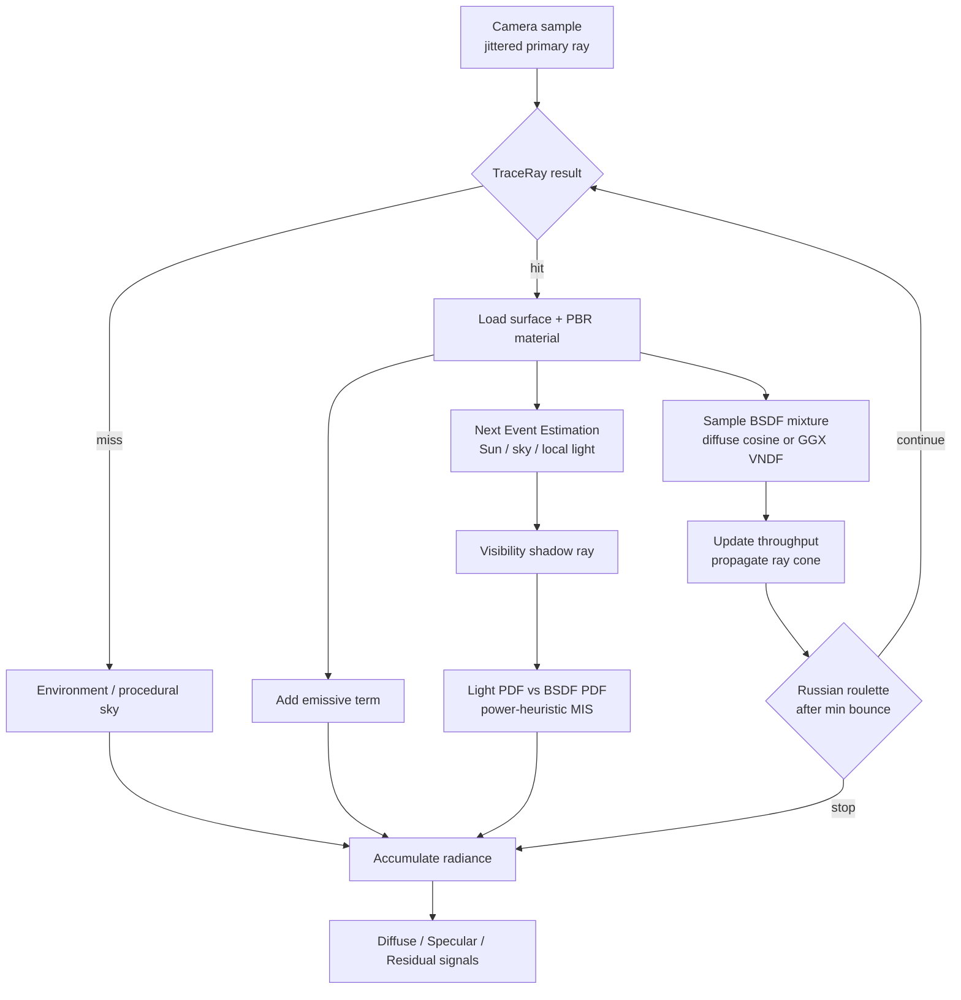

### 4.1 Metallic-roughness PBR BSDF

surface shadingは次を組み合わせます。

- Diffuse: cosine-weighted Lambert項
- Specular: GGX normal distribution、Smith masking-shadowing、Schlick Fresnel
- Metallic workflow: dielectricの `F0=0.04` とbase colorをmetallicで補間
- roughness下限 `0.04`: 極端なdeltaに近いhighlightによる数値不安定を避ける

continuation rayはdiffuse/specularのmixtureから1つのlobeを選びます。specular方向にはHeitz方式のisotropic GGX VNDF samplingを使い、grazing angleでも可視microfacet normalを効率よくsampleします。throughputは、選択したlobeだけではなくfull BSDFを同じmixture PDFで割って更新します。

PBRT `dielectric` materialは独立したdelta interface経路を使います。界面の入射／出射向きを維持して正確な非偏光Fresnel反射率を評価し、全反射とSnell屈折、radiance transportのrelative-IOR Jacobianを適用します。PBRT `thindielectric`の透過方向は変えず、2界面分の実効Fresnelを使います。これらのdelta境界はdiffuse/glossy bounce budgetを消費しません。RTXDIには屈折後の正確なworld-space受光位置と入射方向を渡します。屈折causticsは現在のestimator対象外なので、shadowとinline GI visibilityは直進透過近似のままです。

### 4.2 Next Event Estimation と MIS

BSDF rayだけでは、小さい光源に偶然当たる確率が低くなります。そこで各path vertexから光源方向を直接sampleする Next Event Estimation（NEE）を行い、shadow rayでvisibilityを確認します。

現在のBaseline pathは次を評価します。

- Sun: `N dot L <= 0` ならshadow rayを出さないdelta light
- Environment / procedural sky: HDRIがあれば輝度 × `sin(theta)` のalias tableでimportance sampling
- Emissive mesh triangleとprocedural analytic area light: powerに基づくalias tableからlightを選択
- BSDF sampleがskyやemissiveへ到達した場合: 対応するlight PDFを計算

light samplingとBSDF samplingが同じpathを生成できるときはpower heuristicで重み付けします。

```text
w_light = p_light^2 / (p_light^2 + p_bsdf^2)
```

これにより、小光源はlight sampling、鋭い反射はBSDF samplingという、それぞれ得意なtechniqueを滑らかに組み合わせます。

### 4.3 Russian roulette と最終bounce省略

設定したminimum bounce以降は、throughputに応じた確率でpathを終了します。継続したpathはthroughputを継続確率で割るため、Reference経路の期待値は維持されます。

最終bounceではNEEとemissionを加えた後に次のrayをtraceできません。そのためBSDF方向生成、PDF、throughput更新、rouletteを省略します。これは画質を変えずにshader workを減らす例です。

## 5. サンプリングとtextureの安定化

### 5.1 Owen-scrambled Sobol

乱数列は [`PathTracingSampling.hlsli`](../Shaders/PathTracingSampling.hlsli) のOwen-scrambled Sobolを使います。pixel、frame/sample、bounce、用途ごとにdimensionを固定しています。

| Dimension用途 | 例 |
|---|---|
| Camera | sub-pixel primary ray |
| Sky | environment方向とalias選択 |
| Light | light IDとlight surface |
| BSDF | lobe選択と方向 |
| Russian roulette | path継続判定 |

用途を固定すると、ある機能をON/OFFしたときに後続の乱数dimensionがずれて画面全体のnoise patternが変わる問題を避けやすくなります。adaptive samplingではframeごとに32 sample分のindex区間を予約し、sample数が変化しても乱数列を巻き戻しません。

既定の `Stable32` camera jitterはHalton base 2/3を32 phaseで繰り返し、sample 0はhostのtemporal jitterと一致します。UIでは長周期のHaltonまたはOffも選択できます。複数SPPでは追加sampleごとに別のprimary rayを生成します。

### 5.2 Ray cone と mip LOD

ray tracingにはrasterizerの画面微分が自動ではありません。mip 0を常に読むと、遠方texture、normal map、HDRI、alpha foliageがframeごとに激しく変化します。

この実装はcamera pixelからray coneのspreadを始め、hit距離とscatter roughnessに応じてcone幅を伝播します。三角形のworld面積とUV面積、入射角からUV footprintを求め、`SampleLevel` のmip LODを決めます。

### 5.3 Alpha coverage とspecular AA

- alpha-masked base-color textureはmip生成時にcoverageを維持するようalpha scaleを補正
- AnyHitもray coneから求めたmipを使い、遠方foliageのboilingを抑制
- normal mipの平均vector長からnormal varianceを推定し、roughnessへ加えるToksvig相当のspecular AA
- material feature bitで存在しないtextureをsampleせず、packed ORMは1回だけsample

これらは「後段でblurする」のではなく、rayが観測するfrequencyを正しく制限する対策です。

## 6. Surface Guides と Lighting Signals

少ないSPPを時間的に安定化するには、RGBだけでなく「同じsurfaceか」を判定する情報が必要です。最初のpath sampleのprimary hitからguideを生成します。

現在のGPU texture packは次の意味を持ちます。

| Resource | 内容 |
|---|---|
| `g_denoiseAov0` | world-space shading normalを0..1 encodingしたRGB + 正のlinear view-Z |
| `g_denoiseAov1` | base color RGB + linear roughness |
| `g_denoiseAov2` | `previousUV - currentUV`、`previousViewZ - currentViewZ`、primary hit T |
| `g_surfaceIdentity` | instance / geometry / materialのhash、primitive signature、4-bit coverageをpackしたID |
| `g_signalDirect` | primary diffuse-lobe estimator RGB + 最初のdiffuse-secondary hit distance |
| `g_signalIndirect` | primary specular-lobe estimator RGB + 最初のspecular-secondary hit distance |
| `g_signalResidual` | emission/sky等の非filter residual RGB + metallic |
| confidence textures | diffuse/specularそれぞれのsample・history信頼度 |

resource名の `Direct` / `Indirect` は古い命名です。現在の意味はDiffuse / Specular lobeです。C++の公開semantic契約は [`RenderStabilityTypes.h`](../Source/RenderStabilityTypes.h) の `SurfaceGuides` と `LightingSignals` に定義されています。compact Primary Visibility path は追加で position + ray-cone width、geometric normal + cone spread、完全な instance/geometry/primitive/material ID を書きます。shading normal は共通 guide pack に残します。

primary hit距離とsecondary hit距離は別物です。denoiserがreflectionやdiffuse lobeの空間的広がりを判断するには、そのlobeの最初のcontinuation rayがどこまで進んだかが必要です。adaptive halfでsecondaryをskipした場合はhit distance 0を「未sample」のsentinelとして使います。

## 7. Motion、再投影、history

### 7.1 2.5D motion

surface motionはnon-jitter座標で次のように保存します。

```text
motion.xy = previousUV - currentUV
motion.z  = previousViewZ - currentViewZ
```

historyを読む時だけcurrent/previous jitter差を加えます。motion自体へjitterを焼き込まないため、NRD、ReSTIR、TAAが同じ契約を使えます。sky/missにはcamera回転から再構築したbackground motionをFinal TAAで使います。

### 7.2 Validated bilinear reprojection

単純に最寄りpixelの過去RGBを読むと、輪郭でforegroundとbackgroundを混ぜます。この実装はreproject先のbilinear 4 tapを個別に検証します。

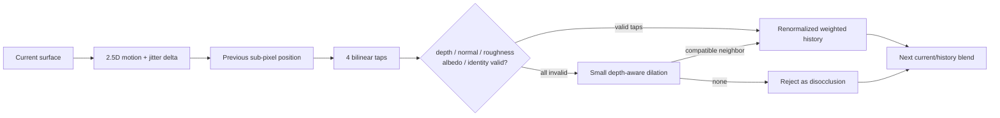

小さいdilationは全4 tapが無効なときだけ使います。有効なbilinear reconstructionへ近傍を混ぜないことで、輪郭blurを抑えます。

### 7.3 Immutable A/B ping-pong

Surface GuideはA/Bの2組を持ち、frame parityでcurrentとpreviousを入れ替えます。1 dispatch内で同じhistory UAVを読み書きせず、previousはframe中immutableです。frame末尾の4枚分のfull-resolution copyはなく、次frameの書き込み前にUAV ordering pointだけを置きます。

同じ考え方をTAA history、internal denoiser history、RTXDI reservoirにも使います。

### 7.4 History domain

すべてを毎回resetするとcamera移動中にnoiseが戻り、何もresetしないと古い照明やgeometryがghostになります。hostは変更を `FrameChangeMask` で記録し、必要な `HistoryDomain` だけを無効化します。

| 変更 | Surface | Lighting / RTXDI | Denoiser / TAA | Reference accumulation |
|---|---|---|---|---|
| 通常のcamera移動 | 維持して再投影 | 維持 | 維持 | reset |
| camera cut / projection / resize | reset | reset | reset | reset |
| material / light / HDRI | 維持 | reset | reset | reset |
| geometry / topology | reset | reset | reset | reset |
| denoiser設定 | 維持 | 維持 | reset | 原則維持 |
| backend / quality profile | 維持 | reset | reset | reset |
| debug view等のview設定 | 維持 | 維持 | reset | reset |

## 8. RTXDI ReSTIR DI

ReSTIR DIは、多数のlight candidateを毎pixelで完全評価する代わりに、少数candidateから代表sampleを選び、そのsampleを時間・空間方向に再利用する手法です。

reservoirはRGB平均ではありません。次のようなsample identityと統計を持ちます。

- light indexとlight上のsample UV
- weight / inverse PDF、target PDF
- 見たcandidate数 `M`
- spatial distance、visibility field、age

現在の実装は2 dispatchです。

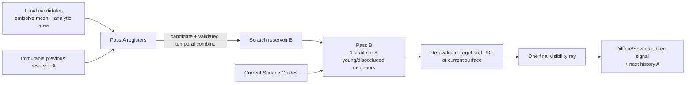

Pass Aではlocal candidateをregisterに置いたままprevious reservoirとcombineし、scratch Bへ1回だけ書きます。Pass Bはscratchだけを読み、stable historyでは4近傍、young/disocclusionでは最大8近傍をcombineします。最後に選ばれたsampleはcurrent surfaceでtarget、PDF、emissive texture、BSDF、visibilityを再評価します。

RTXDI と Baseline は emissive mesh triangle、analytic area light、Sun、Environment の統一 light 契約を共有します。`ReSTIR GI` は Baseline one-light direct + RTXDI GI、combined は RTXDI DI + GI を実行します。詳細は [RTXDI](rtxdi.ja.md) を参照してください。

## 9. Denoiser

### 9.1 なぜlobeを分けるのか

Diffuseは広い近傍へなめらかに変化しやすい一方、低roughness Specularは小さい位置・normal誤差で反射方向が大きく変わります。同じfilter強度を使うと、Diffuseのnoiseが残るかSpecularがblurします。そのためhistory、moments、confidence、hit distanceをlobeごとに扱います。

### 9.2 NVIDIA NRD

`NrdPrepareCS` はSurface Guidesとlobe estimatorをNRDの公式resource契約へ変換します。

1. world normal + roughnessを公式encodingでpack
2. positive linear view-Zと2.5D motionを出力
3. material factorでDiffuse/Specularをdemodulate
4. 実secondary hit distanceとconfidenceをREBLUR/RELAX形式でpack
5. NRD dispatch後、material factorを戻してresidualを加える

`interactive_game`はREBLUR、`sharp_preview`はRELAXを選びます。通常のNRD Beautyでは独立した `NrdCompositeCS` を省き、`FinalTaaCS` がNRD出力を直接remodulate、合成します。validation view、quality benchmark、TAA OFFでは明示Compositeを残します。現在 `NrdPrepareCS` 自体はまだ独立passです。

### 9.3 Internal fallback

NRDがcompileされていない、SDK evaluationが利用できない、またはinternalを選んだ場合は自前denoiserを使います。

- validated bilinear temporal reprojection
- Diffuse/Specular別history、first/second luminance moments、history length
- RGB neighborhood clamp、luminance moments、confidenceによるanti-lag
- normal、view-Z、albedo、roughness、motionによるconfidence
- lobe hit distanceを使うedge-aware A-Trous filter
- 低roughness Specularの短いhistoryと強いrejection

NRDとfallbackの詳細は [NRD backend](nrd.ja.md) を参照してください。

| Denoise Off | Internal temporal / A-Trous |
|:---:|:---:|
|  |  |

`Off` はcurrent Monte Carlo varianceをそのまま表示し、`Internal` はnativeのsplit-signal
temporal / A-Trous pathを選択します。独立したDLSS availability設定を含む全backend比較は
[Denoise UIとfallback比較](denoise-ui.ja.md)を参照してください。

## 10. Final HDR TAA、sharpen、tone mapping

denoiserは主にsurface lightingを安定化しますが、silhouette、sky、alpha coverage、最終合成にも時間的な揺れが残ります。そのためdenoise後、tone mapping前のHDRに1:1 Final TAAを適用します。

`FinalTaaCS` は次を行います。

1. current HDRの8×8 groupと1 pixel haloを10×10 groupshared tileへ読み込む
2. surface motionまたはbackground motionでhistoryを再投影
3. guide検証済みbilinear historyを取得
4. current 3×3 neighborhoodのYCoCg範囲へ、young/reactive historyだけをclip
5. motion、history length、stop-and-go settle、NRD maturityからcurrent weightを決定
6. 成熟した静止historyだけにcontrast-adaptive sharpenを適用
7. HDR historyを保存し、exposure、tone mapper、gammaを適用

静止時の長いhistory windowはnoiseを抑えますが、早くlockしすぎるとdenoiserの初期blurまで固定します。現在はREBLURのmaturity期間中に最大32 frame程度の更新apertureを残し、その後に長い安定windowへ移行します。sharpenは設定された強度を上限とし、平坦部、極端なedge、motion中には弱めます。難しいsceneで残留Monte Carlo分散を増幅しないようopt-in（既定値 `0`）です。

tone mapperは `None`、Reinhard、ACES fitted curveを選択できます。ここでのACESは完全なACES色管理pipelineではありません。どれもpath estimatorを変える処理ではなく、HDR値をdisplay可能な範囲へ写像する表示変換です。

| None | Reinhard | ACES fitted curve |
|:---:|:---:|:---:|
| 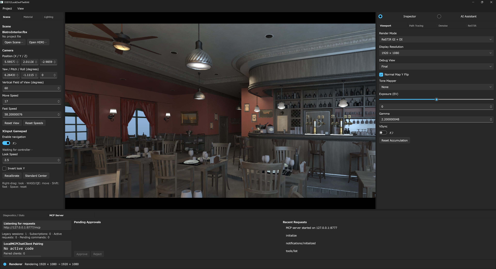 | 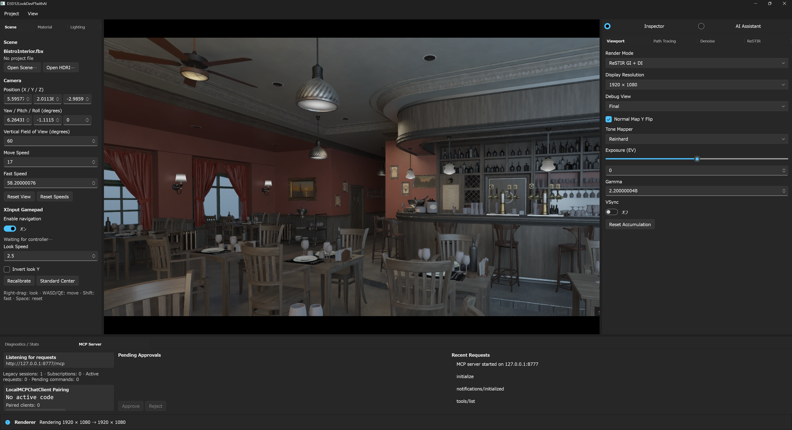 | 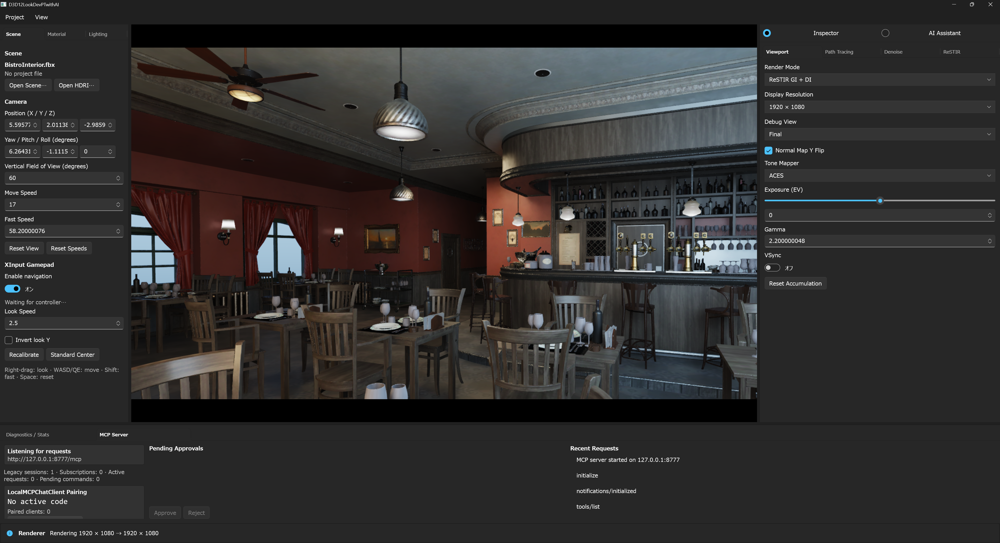 |

どちらも同じBistro viewとexposureを使っています。Inspectorからdisplay transformを直接
変更でき、application screenshotで示すようにAI Assistantからも
`lookdevpt.set_color_management` で同じ設定へ到達できます。

## 11. Adaptive sampling とray budget

Interactiveはframe timeと画質を両立するため、次を動的に調整します。

- camera移動中: 既定1 spp、最大2 bounce
- 停止後: `settleFrames` に沿ってbounceと追加sample quotaを段階復帰
- 高variance、history不足、disocclusion: 最大adaptive SPPへ昇格
- 継続してGPU budget超過: 追加sample quota、bounce、最後にsecondary shading rateを削減
- 十分長くbudget以下: 1段階ずつ品質を復帰

adaptive SPP は pixel 単位で分類します。internal denoiser 使用時は previous moments、外部 backend 時は sample 0 と検証済み TAA history の luminance residual を使います。eligible な Interactive Baseline/DI frame では、256-thread local prefix scan と group scan で SPP count を pixel/sample 順 `SecondaryTask` list と 1D DispatchRays argument に変換します。`ExecuteIndirect` は task ごとの result を書き、8x8 pixel resolve が競合書き込みなしで平均化します。

compact path は現在、保存した primary intersection から直接継続せず secondary task ごとに完全な camera sample を再 trace します。workload graph と exact primary AOV 契約は実装済みですが、性能最適化の達成はまだ主張しません。DXR 1.0、Reference Still、RTXDI GI/PT、quality diagnostics は full-dispatch megakernel を使います。

`adaptive_half` はprimary visibilityとprimary vertex direct lightingをfull resolutionに保ち、BSDF continuation以降だけをcheckerboardで半分skipします。ただし次はfull-rateへ昇格します。

- historyが無効、disocclusion、young history
- alpha mask / coverage edge
- roughness `< 0.15`
- metallicや高いspecular probability
- variance、reactive、confidenceが不安定

## 12. Contribution compression

1 sppでは、ごく低確率の高energy pathが単発のfireflyになります。Interactiveではluminance limitを超えたpath contributionへ共通scaleを掛けます。

重要なのは、BeautyだけをclampせずDiffuse/Specular信号にも同じscaleを掛けることです。そうしないとdenoiserが見る信号と最終推定値のenergyが一致しません。external denoiser のmaterial demodulationでfiltered outlierが再増幅される場合があるため、Final TAA前のHDR reconstruction境界で同じluminance契約を1回だけ再適用します。quality benchmarkはestimator圧縮前後のenergyを記録します。

Reference Stillではlimitを0にしてcontribution compressionとtemporal clampを無効化します。

## 13. Render mode と Quality profile

### Render mode

| UI / project名 | 現在の実効処理 |
|---|---|
| `Baseline PT` | Baseline MIS direct + indirect |
| `ReSTIR DI` | RTXDI local-light DI + Baseline indirect / Sun / Environment |
| `ReSTIR GI` | Baseline one-light direct + RTXDI GI |
| `ReSTIR GI + DI` | RTXDI DI + RTXDI GI |
| `ReSTIR PT` | Baseline one-light direct + checkerboard RTXDI PT |
| `ReSTIR PT + DI` | RTXDI DI + checkerboard RTXDI PT |

RTXDIをbuildしていない、runtime ABI checkに失敗、`restirBackend: off`、またはReference Stillの場合はBaseline PTへfallbackします。

### Quality profile

| Profile | Denoiser | Temporal処理 | Secondary | 用途 |
|---|---|---|---|---|
| `interactive_game` | REBLURまたはinternal fallback | ReSTIR DI（選択時）+ Final TAA | `auto`可 | 操作中の安定性と速度 |
| `sharp_preview` | RELAXまたはinternal fallback | ReSTIR DI（選択時）+ Final TAA | full | 静止寄りのsharp preview |
| `reference_still` | Off | RTXDI / Final TAA Off | full | 高SPP基準画像 |

## 14. GPU/CPU性能のための実装

画質algorithm以外にも、同じ結果を少ないworkで得る工夫があります。

- 3個のFrameContextでCPUとGPUをoverlapし、毎Present後の強制waitを避ける
- descriptor tableをframe別または固定A/Bとして用意し、GPU使用中に書き換えない
- non-alpha geometryをopaque化してAnyHitをskip
- 32-byte path payloadと12-byte shadow payload
- material feature bit、packed ORM、texture existence cache
- camera ray cone spreadをhostで1回計算
- fused 2-pass ReSTIR DIとreservoir publish copy削除
- Surface Guideのfull-resolution history copy削除
- 通常NRD BeautyでCompositeとFinal TAAを融合
- 非表示の WinUI editor panel を更新せず、Render Only Mode では editor chrome を collapse
- performance benchmarkでは全画面quality counterを実行しない

これらの効果は `Diagnostics / Stats` とbenchmarkのpass別timestampで確認できます。

## 15. Debug Viewを使った学習手順

Beautyだけを見ると、問題がsampling、guide、denoiser、TAAのどこで生まれたか分かりません。次の順番で観察すると理解しやすくなります。

1. `Base Color`、`World Normal`、`Normal Texture`、`Roughness`、`Metallic`でmaterial入力を確認
2. `Motion Vector`、`NRD Linear View-Z`、`NRD 2.5D Motion`でreprojection入力を確認
3. `Diffuse Signal`、`Specular Signal`、`Emission / Sky`を個別に確認
4. `NRD Input Validation`、`Temporal Input`、`Temporal Output Detail`、`A-Trous Output`を比較
5. `History Length`、`History Confidence`、`TAA History Acceptance`を確認
6. FinalとReference Stillを同じcameraで比較

| Base Color | World Normal |
|:---:|:---:|
| 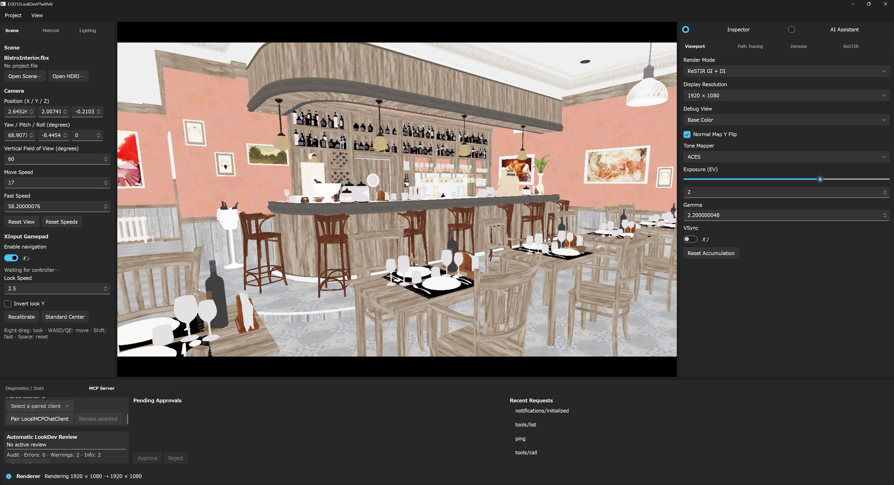 | 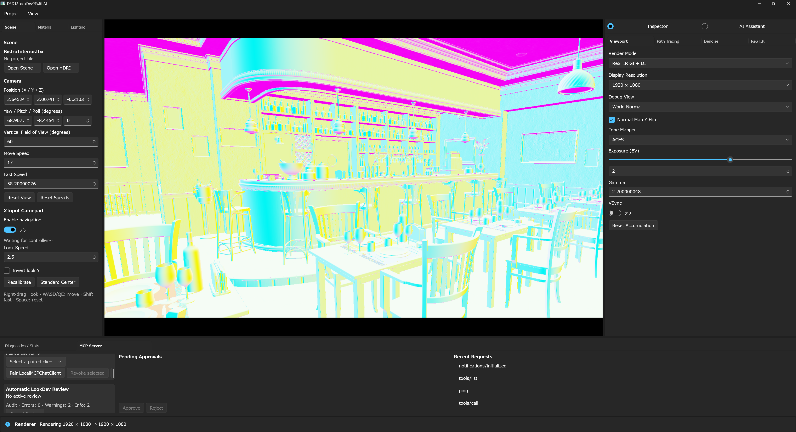 |

`Base Color` はimportしたmaterial colorをlightingから分離し、`World Normal` はorientationの
不連続やnormal-map conventionの問題がdenoise / temporal reuseへ入る前に可視化します。

| Hit Distance | Indirect lighting |
|:---:|:---:|
| 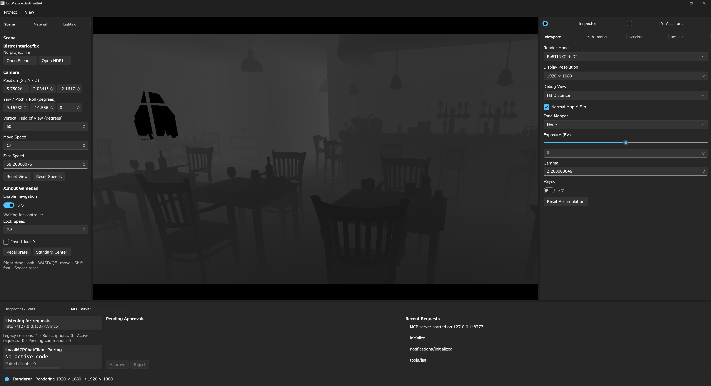 | 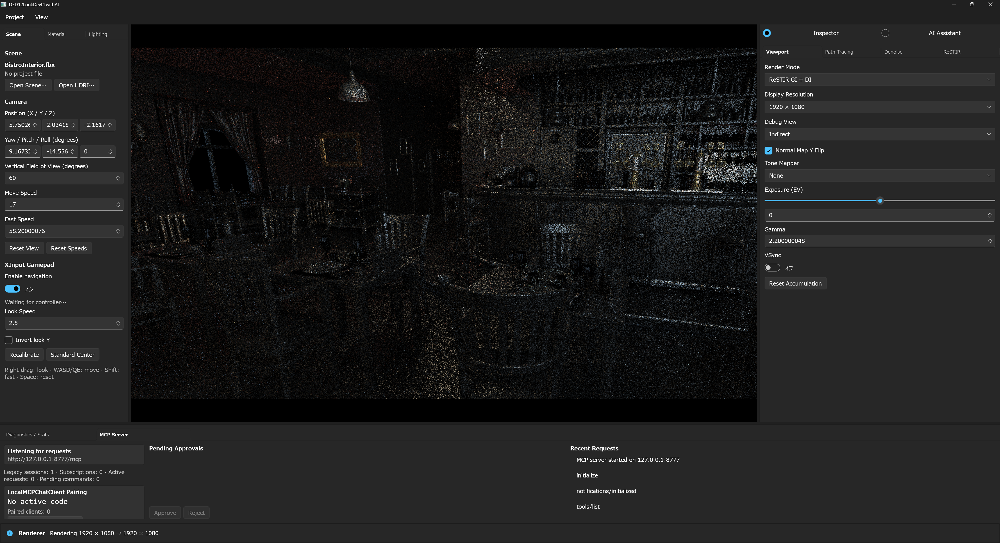 |

`Hit Distance` はreconstruction filterが扱うgeometry scaleを可視化します。`Indirect` は
multi-bounce transportを分離し、direct-light samplingとindirect-light noiseを個別に調査
できます。

おすすめの小実験:

- roughness sweepをpanし、specular highlightとray-cone mipの変化を見る
- alpha foliageをdollyし、mip coverageとAnyHitの安定性を見る
- 小さいemissiveをBaseline / ReSTIR DIで比較する
- camera cutでhistory acceptanceが0になることを確認する
- slow pan、fast turn、stop-and-goでghostingとsettleを観察する
- denoiser OffでもSurface Guidesが毎frame更新されることを確認する
- `reference_still`をhigh-SPPまで蓄積し、Interactiveのbiasとblurを比較する

再現比較には固定seedとcamera pathを使うbenchmarkが向いています。手順は [benchmark path と解析](../benchmarks/README.md) を参照してください。

## 16. 実装ファイル案内

| 読みたい内容 | 主なファイル |
|---|---|
| frame graph、resource、dispatch順 | [`D3D12PathTracingBackend.cpp`](../Source/D3D12PathTracingBackend.cpp) |
| FrameState、history domain、signal semantic | [`RenderStabilityTypes.h`](../Source/RenderStabilityTypes.h) |
| path loop、BSDF、MIS、ray cone、AOV出力 | [`PathTracingABI.hlsli`](../Shaders/PathTracingABI.hlsli) |
| Sobol / Owen sampling | [`PathTracingSampling.hlsli`](../Shaders/PathTracingSampling.hlsli) |
| RTXDI 2-pass ReSTIR DI | [`ReSTIRResolve.hlsl`](../Shaders/ReSTIRResolve.hlsl) |
| RTXDI GI / checkerboard PT | [`PathTracingReSTIR.hlsl`](../Shaders/PathTracingReSTIR.hlsl)、[`PathTracingReSTIRPT.hlsl`](../Shaders/PathTracingReSTIRPT.hlsl) |
| Primary Visibility と compact secondary task | [`PathTracingSecondaryWork.hlsl`](../Shaders/PathTracingSecondaryWork.hlsl) |
| internal temporal / A-Trous | [`PathTracingDenoise.hlsl`](../Shaders/PathTracingDenoise.hlsl) |
| NRD input pack / composite | [`PathTracingNrd.hlsl`](../Shaders/PathTracingNrd.hlsl) |
| HDR TAA/TAAU / sharpen / tone map | [`PathTracingTaa.hlsl`](../Shaders/PathTracingTaa.hlsl) |
| DLSS-RR guide prepare | [`PathTracingDlss.hlsl`](../Shaders/PathTracingDlss.hlsl) |
| NRD SDK bridge | [`NrdBackend.cpp`](../Source/NrdBackend.cpp) |
| RTXDI SDK/build boundary | [`RtxdiBackend.cpp`](../Source/RtxdiBackend.cpp) |
| texture mipとalpha coverage | [`TextureLoader.cpp`](../Source/TextureLoader.cpp) |

## 17. 現在の制限

次は将来拡張であり、現在完了済みとして扱わないでください。

- camera sample を再 trace せず、保存済み primary intersection から compact secondary task を継続する最適化
- 現在の reconnection target shift を超える、RTXDI Full Sample 相当の完全な PT hybrid-shift path replay
- moving instance、skinning、continuous deformation用previous transform
- NVIDIA 発行 NGX application ID と対応 GPU/failure matrix を使う active DLSS-RR 認証
- 全必須 Bistro/HDRI/material scene の temporal/reference 品質 acceptance
- DXR非対応GPU向けのraster fallback
- UI/JSONに残る `movingJitterScale` の実jitter振幅への反映

shader counter は primary、secondary、shadow、DI/GI/PT visibility、AnyHit invocation を報告します。標準 DXR は BVH node visit 数を公開しないため、hardware traversal とは表記しません。

また、optional backendが「起動できる」ことと、すべてのsceneで1080p60、blur、ghostingの品質gateを満たすことは別です。固定camera path、high-SPP reference、pass timingを使ってsceneごとに検証する必要があります。

## 18. 用語集

| 用語 | 意味 |
|---|---|
| SPP | Samples Per Pixel。1 frameで1 pixelにtraceするpath sample数 |
| Bounce | pathがsurfaceで反射・散乱した回数 |
| NEE | 光源を直接sampleしてshadow rayを飛ばす方法 |
| MIS | 複数のsampling techniqueをPDFに基づいて組み合わせる方法 |
| PDF | そのsampleが選ばれる確率密度 |
| AOV / Guide | Beauty以外のnormal、depth、motion等の補助情報 |
| Demodulation | material係数を一時的に外し、照明signalをfilterしやすくすること |
| Reprojection | motionを使ってcurrent pixelに対応するprevious位置を探すこと |
| Disocclusion | camera移動等で以前は隠れていたsurfaceが新しく見えること |
| Reservoir | ReSTIRが代表sampleとweight統計を保持する構造 |
| Ray cone | rayが代表するfootprintの広がりを近似するもの |

## 関連ドキュメント

- [NVIDIA開発・Release setup](nvidia-setup.ja.md)
- [Optional NVIDIA NRD Backend](nrd.ja.md)
- [Optional NVIDIA RTXDI ReSTIR DI](rtxdi.ja.md)
- [Optional DLSS Ray Reconstruction](dlss.ja.md)
- [アセットの配置](assets.ja.md)
- [Benchmark path と解析](../benchmarks/README.md)
