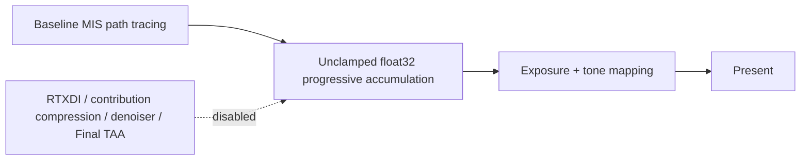
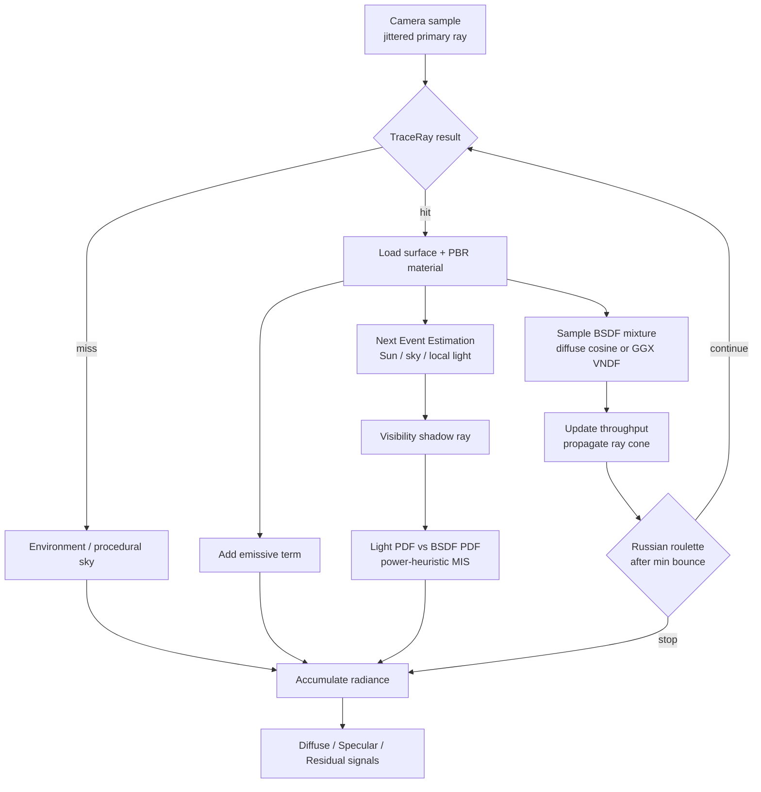
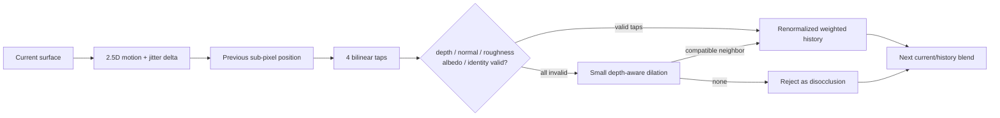
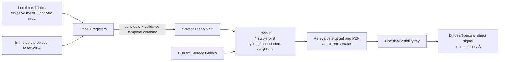

# D3D12LookDevPTwithAI Rendering Pipeline Learning Guide

Japanese documentation: [レンダリングパイプライン学習ガイド](rendering-pipeline.ja.md)

This guide is intended for students of real-time rendering and path tracing who want to connect each stage of D3D12LookDevPTwithAI's implementation to the process that turns one frame into an image. It covers not only the algorithms in general, but also distinguishes what is implemented in the current repository, what is provided by optional backends or fallbacks, and what remains unimplemented.

A good reading order is to start with the full-frame overview, inspect the stages that interest you through Debug Views, and then read the linked shaders.

> [!NOTE]
> This document describes the current implementation, not a target architecture. Eligible DXR 1.1 Interactive Baseline/DI frames use an independent Primary Visibility and compact secondary-task graph; RTXDI GI/PT, Reference Still, DXR 1.0, and diagnostic runs retain the megakernel. RTXDI provides DI, GI, and checkerboard PT, and DLSS Ray Reconstruction has a complete per-frame tagging/evaluation path.

## 1. Two Output Goals

D3D12LookDevPTwithAI separates two rendering paths with different goals.

| Path | Goal | Main approach |
|---|---|---|
| Interactive | Aim for stable, game-like quality while navigating at 1080p | Reuse a small number of rays over time and allow some bias to suppress noise and flicker |
| Reference Still | Produce a high-SPP reference image for comparing materials and lighting | Disable ReSTIR, contribution compression, the denoiser, and Final TAA, then accumulate Baseline MIS for a long time |

Interactive output stabilizes faster than the Reference path because it uses previous frames, neighboring pixels, and prior knowledge encoded in the denoiser. Reference Still instead prioritizes a simple estimator that converges through many samples rather than temporal stabilization.

## 2. Full View of One Frame

The ordinary Interactive Beauty path follows the host-side [`D3D12PathTracingBackend::PopulateCommandList`](../Source/D3D12PathTracingBackend.cpp) in this order:

```mermaid
flowchart LR
    FS["FrameState / camera / jitter / history validity"] --> W{"Compact secondary<br/>eligible?"}
    W -->|"yes"| PV["Primary Visibility<br/>full guides and IDs"]
    PV --> CW["SPP prefix scan<br/>SecondaryTask list"]
    CW --> SI["1D ExecuteIndirect<br/>secondary tasks + resolve"]
    W -->|"no"| PT["DXR megakernel<br/>path tracing + first-hit guides"]
    SI --> G
    PT --> G["Surface guides<br/>normal, view-Z, motion, identity"]
    SI --> S
    PT --> S["Lighting signals<br/>diffuse, specular, residual"]
    G --> R{"RTXDI ReSTIR DI<br/>active?"}
    S --> R
    R -->|"yes"| RA["Pass A<br/>candidate + temporal"]
    RA --> RB["Pass B<br/>spatial + visibility + shade"]
    RB --> GI["Optional RTXDI GI / PT<br/>initial + fused reuse/shading"]
    R -->|"no"| GI
    GI --> D{"Reconstruction"}
    D -->|"NRD"| N["NrdPrepareCS<br/>REBLUR / RELAX"]
    D -->|"Internal"| I["Temporal + moments<br/>hit-distance-aware A-Trous"]
    D -->|"Off"| O["Current HDR"]
    D -->|"DLSS-RR"| DL["Guide prepare + tags<br/>slEvaluateFeature"]
    N --> T["FinalTaaCS<br/>HDR TAA/TAAU + sharpen"]
    I --> T
    O --> T
    DL --> TM
    T --> TM["Exposure + None / Reinhard / ACES fitted<br/>gamma encoding"]
    TM --> P["Swapchain copy + WinUI composition + Present"]
```



The actual command-list order is:

1. `DispatchRays`, or Primary Visibility + compact task generation + 1D `ExecuteIndirect` + pixel resolve
2. `RunRestirReusePass`
3. `RunRestirGiPass` / `RunRestirPtPass` for the selected indirect algorithm
4. `RunDenoisePass`, including DLSS-RR preparation/evaluation when selected and ready
5. `RunFinalTaaPass` for native reconstruction; successful DLSS-RR bypasses it
6. `RunQualityCounterPass` during normal execution and combined/quality benchmarks; skipped only for performance benchmarks
7. `SealSurfaceGuideFrame`
8. `CopyOutputToBackBuffer`
9. Present through the WinUI swap-chain panel. Render Only Mode hides the editor chrome

Tone mapping is conceptually the final stage, but it normally runs at the end of `FinalTaaCS`. Paths that do not use Final TAA perform the same display transform in RayGen or the denoiser composite.

Reference Still uses a separate, shorter path:



## 3. From Scene Data to DXR Traversal

### 3.1 Scene Import and GPU Resources

Static meshes imported by Assimp are converted into vertex/index buffers, geometry records, a material buffer, and a texture table. Materials contain base color, normal, roughness, metallic, occlusion, emissive, and alpha-mask inputs.

DXR uses the following acceleration structures:

- BLAS: a structure for traversing the triangles in mesh geometry
- TLAS: a structure that combines instances and BLASes for traversal of the full scene

Non-alpha geometry is marked with `D3D12_RAYTRACING_GEOMETRY_FLAG_OPAQUE` to avoid unnecessary AnyHit invocations. Editing an alpha mask also changes the geometry flag, so the BLAS is updated. Static BLAS builds request compaction, query the post-build compacted size, compact-copy before TLAS construction, and release the original result and scratch resources after initialization.

### 3.2 Shader Stages and Small Payloads

The primary shaders for the DXR pass are in [`PathTracingABI.hlsli`](../Shaders/PathTracingABI.hlsli).

| Shader | Role |
|---|---|
| `RayGen` | Generate a camera ray per pixel, run the path loop, evaluate the material/BSDF, and output AOVs and signals |
| `Miss` | Report that the ray did not hit geometry |
| `ClosestHit` | Store only hit distance, barycentrics, and instance/geometry/primitive IDs in the payload |
| `AnyHit` | Inspect the alpha-mask texel and call `IgnoreHit` when it is transparent |
| `ShadowMiss` / `ShadowAnyHit` | Lightweight shaders for visibility rays |

The path payload is 32 bytes, and the shadow payload is 12 bytes. Evaluating material textures in ClosestHit would require carrying that state in a larger payload. Instead, this implementation returns only intersection information and evaluates the material once in RayGen, reducing register pressure and memory traffic during ray traversal.

## 4. Path Tracing One Pixel

The conceptual flow of one sample is:



### 4.1 Metallic-Roughness PBR BSDF

Surface shading combines:

- Diffuse: a cosine-weighted Lambert term
- Specular: GGX normal distribution, Smith masking-shadowing, and Schlick Fresnel
- Metallic workflow: interpolate between dielectric `F0=0.04` and the base color using metallic
- Minimum roughness of `0.04`: avoids numerical instability from highlights that approach an extreme delta distribution

A continuation ray selects one lobe from the diffuse/specular mixture. The specular direction uses Heitz-style isotropic GGX VNDF sampling to efficiently sample visible microfacet normals even at grazing angles. Throughput is updated by dividing the full BSDF, not only the selected lobe, by the same mixture PDF.

PBRT `dielectric` materials use a separate delta-interface path. The renderer preserves the entering/exiting orientation, evaluates exact unpolarized Fresnel reflectance, handles total internal reflection, and applies Snell refraction with the radiance relative-IOR Jacobian. PBRT `thindielectric` keeps the ray direction unchanged on transmission and uses the effective two-interface Fresnel term. These delta boundaries do not consume the diffuse/glossy bounce budget. RTXDI receives the exact world-space receiver position and incident direction after refraction; shadow and inline GI visibility remain straight-through approximations because refractive caustics are outside the current estimator.

### 4.2 Next Event Estimation and MIS

With BSDF rays alone, the probability of randomly hitting a small light is low. Next Event Estimation (NEE) therefore samples a direction toward a light directly at every path vertex and tests visibility with a shadow ray.

The current Baseline path evaluates:

- Sun: a delta light for which no shadow ray is emitted when `N dot L <= 0`
- Environment / procedural sky: importance sampled through a luminance times `sin(theta)` alias table when an HDRI is present
- Emissive mesh triangles and procedural analytic area lights: selected from a power-weighted light alias table
- BSDF samples that reach the sky or an emitter: the corresponding light PDF is evaluated

When light sampling and BSDF sampling can generate the same path, they are weighted with the power heuristic:

```text
w_light = p_light^2 / (p_light^2 + p_bsdf^2)
```

This smoothly combines the strengths of each technique: light sampling for small lights and BSDF sampling for sharp reflections.

### 4.3 Russian Roulette and Final-Bounce Elision

After the configured minimum bounce, a path terminates with a probability derived from its throughput. A surviving path divides its throughput by the continuation probability, preserving the expected value in the Reference path.

After adding NEE and emission on the final bounce, another ray cannot be traced. The shader therefore skips BSDF direction generation, PDF calculation, throughput update, and roulette. This is an example of reducing shader work without changing image quality.

## 5. Sampling and Texture Stability

### 5.1 Owen-Scrambled Sobol

Random sequences use Owen-scrambled Sobol from [`PathTracingSampling.hlsli`](../Shaders/PathTracingSampling.hlsli). Dimensions are fixed by pixel, frame/sample, bounce, and purpose.

| Dimension purpose | Example |
|---|---|
| Camera | Sub-pixel primary ray |
| Sky | Environment direction and alias selection |
| Light | Light ID and light surface |
| BSDF | Lobe selection and direction |
| Russian roulette | Path continuation decision |

Fixed purposes help prevent a feature being enabled or disabled from shifting later random dimensions and changing the noise pattern across the entire image. Adaptive sampling reserves an interval of 32 sample indices per frame so a changing sample count never rewinds the sequence.

The default `Stable32` camera jitter repeats a 32-phase Halton sequence with bases 2 and 3, and sample 0 matches the host temporal jitter. The UI can also select a longer-period Halton sequence or Off. At multiple SPP, each additional sample generates a distinct primary ray.

### 5.2 Ray Cones and Mip LOD

Ray tracing does not automatically receive the screen-space derivatives available to a rasterizer. Always reading mip 0 makes distant textures, normal maps, HDRIs, and alpha foliage change violently from frame to frame.

This implementation initializes a ray-cone spread from the camera pixel and propagates the cone width according to hit distance and scattering roughness. It derives a UV footprint from the triangle's world-space area, UV-space area, and incidence angle, then uses that footprint to select a `SampleLevel` mip LOD.

### 5.3 Alpha Coverage and Specular AA

- Alpha-masked base-color textures receive a corrected alpha scale during mip generation to preserve coverage
- AnyHit also uses the ray-cone-derived mip to reduce boiling in distant foliage
- Toksvig-like specular AA estimates normal variance from the mean vector length in a normal mip and adds it to roughness
- Material feature bits skip textures that do not exist, and packed ORM is sampled only once

These techniques control the frequency observed by the ray correctly instead of blurring the result in a later stage.

## 6. Surface Guides and Lighting Signals

Stabilizing a low-SPP result over time requires more than RGB; the renderer also needs information that determines whether two samples belong to the same surface. Guides are generated from the primary hit of the first path sample.

The current GPU texture pack has these meanings:

| Resource | Contents |
|---|---|
| `g_denoiseAov0` | RGB containing a 0..1 encoding of the world-space shading normal, plus positive linear view-Z |
| `g_denoiseAov1` | Base color RGB plus linear roughness |
| `g_denoiseAov2` | `previousUV - currentUV`, `previousViewZ - currentViewZ`, and primary hit T |
| `g_surfaceIdentity` | A packed instance / geometry / material hash, primitive signature, and 4-bit coverage value |
| `g_signalDirect` | RGB primary diffuse-lobe estimator plus the first diffuse-secondary hit distance |
| `g_signalIndirect` | RGB primary specular-lobe estimator plus the first specular-secondary hit distance |
| `g_signalResidual` | Unfiltered residual RGB such as emission/sky, plus metallic |
| Confidence textures | Per-lobe diffuse/specular sample and history confidence |

The resource names `Direct` and `Indirect` are legacy names. Their current meanings are the Diffuse and Specular lobes. The public C++ semantic contract is defined by `SurfaceGuides` and `LightingSignals` in [`RenderStabilityTypes.h`](../Source/RenderStabilityTypes.h). The compact Primary Visibility path additionally writes position plus ray-cone width, geometric normal plus cone spread, and exact instance/geometry/primitive/material IDs. The shading normal remains in the common guide pack.

Primary and secondary hit distances are not interchangeable. To judge the spatial extent of a reflection or diffuse lobe, the denoiser needs to know how far that lobe's first continuation ray traveled. When adaptive half skips a secondary sample, hit distance 0 is used as an "unsampled" sentinel.

## 7. Motion, Reprojection, and History

### 7.1 2.5D Motion

Surface motion is stored in non-jitter coordinates as:

```text
motion.xy = previousUV - currentUV
motion.z  = previousViewZ - currentViewZ
```

The current/previous jitter delta is added only when history is read. Because jitter is not baked into the motion itself, NRD, ReSTIR, and TAA can share the same contract. For sky/miss pixels, Final TAA uses background motion reconstructed from camera rotation.

### 7.2 Validated Bilinear Reprojection

Simply reading the nearest previous RGB pixel mixes foreground and background at silhouettes. This implementation validates all four bilinear taps at the reprojected location independently.



The small dilation runs only when all four taps are invalid. Avoiding extra neighbors when bilinear reconstruction is already valid reduces silhouette blur.

### 7.3 Immutable A/B Ping-Pong

Surface Guides have two A/B sets, with the current and previous set selected by frame parity. The same history UAV is never read and written within one dispatch, and the previous set remains immutable throughout the frame. There is no end-of-frame full-resolution copy of the four textures; only a UAV ordering point is inserted before the next frame writes them.

TAA history, internal-denoiser history, and RTXDI reservoirs follow the same principle.

### 7.4 History Domains

Resetting everything after every change brings noise back during camera motion, while never resetting anything causes old lighting or geometry to ghost. The host records changes in `FrameChangeMask` and invalidates only the required `HistoryDomain` values.

| Change | Surface | Lighting / RTXDI | Denoiser / TAA | Reference accumulation |
|---|---|---|---|---|
| Ordinary camera motion | Preserve and reproject | Preserve | Preserve | Reset |
| Camera cut / projection / resize | Reset | Reset | Reset | Reset |
| Material / light / HDRI | Preserve | Reset | Reset | Reset |
| Geometry / topology | Reset | Reset | Reset | Reset |
| Denoiser setting | Preserve | Preserve | Reset | Preserve in principle |
| Backend / quality profile | Preserve | Reset | Reset | Reset |
| View setting such as a debug view | Preserve | Preserve | Reset | Reset |

## 8. RTXDI ReSTIR DI

Instead of fully evaluating many light candidates at every pixel, ReSTIR DI selects a representative sample from a small candidate set and reuses that sample across time and space.

A reservoir is not an RGB average. It stores sample identity and statistics such as:

- Light index and sample UV on the light
- Weight / inverse PDF and target PDF
- Number of candidates seen, `M`
- Spatial distance, visibility fields, and age

The current implementation uses two dispatches:



Pass A keeps the local candidate in registers while combining it with the previous reservoir, then writes once to scratch B. Pass B reads only scratch, combining four neighbors for stable history or up to eight for young/disoccluded history. The selected sample is finally re-evaluated at the current surface for its target, PDF, emissive texture, BSDF, and visibility.

RTXDI and Baseline share a unified light contract covering emissive mesh triangles, analytic area lights, Sun, and Environment. `ReSTIR GI` runs Baseline one-light direct plus RTXDI GI; the combined mode runs RTXDI DI plus GI. See [RTXDI](rtxdi.md) for details.

## 9. Denoising

### 9.1 Why Split Lobes?

Diffuse lighting usually varies smoothly over broad neighborhoods, while a small position or normal error can change the reflected direction dramatically for low-roughness Specular. Applying one filter strength either leaves Diffuse noisy or blurs Specular. The renderer therefore maintains separate history, moments, confidence, and hit distance for each lobe.

### 9.2 NVIDIA NRD

`NrdPrepareCS` converts Surface Guides and lobe estimators into NRD's official resource contract.

1. Pack world normal and roughness with the official encoding
2. Output positive linear view-Z and 2.5D motion
3. Demodulate Diffuse/Specular by their material factors
4. Pack real secondary hit distance and confidence in REBLUR/RELAX format
5. After the NRD dispatches, restore the material factors and add the residual

`interactive_game` selects REBLUR, while `sharp_preview` selects RELAX. In the ordinary NRD Beauty path, `FinalTaaCS` directly remodulates and composites NRD output, avoiding a separate `NrdCompositeCS`. Validation views, quality benchmarks, and TAA-off operation retain the explicit Composite path. `NrdPrepareCS` itself is still an independent pass.

### 9.3 Internal Fallback

When NRD is not compiled, SDK evaluation is unavailable, or the internal backend is selected, the renderer uses its own denoiser:

- Validated bilinear temporal reprojection
- Separate Diffuse/Specular history, first and second luminance moments, and history length
- RGB neighborhood clamping, luminance moments, and confidence-driven anti-lag
- Confidence based on normal, view-Z, albedo, roughness, and motion
- Edge-aware A-Trous filtering using lobe hit distance
- Short history and strong rejection for low-roughness Specular

See [NRD backend](nrd.md) for details about NRD and the fallback.

## 10. Final HDR TAA, Sharpening, and Tone Mapping

The denoiser mainly stabilizes surface lighting, but temporal variation remains at silhouettes, in the sky, in alpha coverage, and in the final composite. A 1:1 Final TAA pass therefore runs in HDR after denoising and before tone mapping.

`FinalTaaCS` performs these steps:

1. Load an 8x8 group of current HDR plus a one-pixel halo into a 10x10 groupshared tile
2. Reproject history using surface motion or background motion
3. Fetch bilinear history validated against guides
4. Clip only young/reactive history to the YCoCg range of the current 3x3 neighborhood
5. Select the current-frame weight from motion, history length, stop-and-go settling, and NRD maturity
6. Apply contrast-adaptive sharpening only to mature, stationary history
7. Save HDR history, then apply exposure, the tone mapper, and gamma

A long history window suppresses stationary noise, but locking too early would also preserve the denoiser's initial blur. The current implementation keeps an update aperture of up to roughly 32 frames during REBLUR's maturity period, then transitions to a longer stability window. Sharpening is capped by the configured strength and weakens in flat regions, across extreme edges, and during motion. It is opt-in (`0` by default), because nonzero sharpening can amplify residual Monte Carlo variance in difficult scenes.

The available tone mappers are `None`, Reinhard, and an ACES fitted curve. The ACES option here is not a complete ACES color-management pipeline. None of these options changes the path estimator; they are display transforms that map HDR values into a displayable range.

## 11. Adaptive Sampling and the Ray Budget

Interactive dynamically adjusts the following to balance frame time and quality:

- During camera motion: 1 spp by default, up to 2 bounces
- After motion stops: restore bounce count and the additional-sample quota gradually over `settleFrames`
- High variance, insufficient history, or disocclusion: promote up to the adaptive SPP limit
- Sustained GPU budget pressure: reduce the additional-sample quota, then bounce count, and finally the secondary shading rate
- A sufficiently long period below budget: restore quality one step at a time

Adaptive-SPP classification remains per pixel. With the internal denoiser it uses previous moments; with an external backend it uses the luminance residual between sample 0 and validated TAA history. On eligible Interactive Baseline/DI frames, a 256-thread local prefix scan and group scan turn those SPP counts into a pixel/sample-ordered `SecondaryTask` list and a 1D DispatchRays argument. `ExecuteIndirect` writes one task result per entry, then an 8x8 pixel resolve averages the results without competing pixel writes.

The compact path currently retraces the complete camera sample per secondary task instead of continuing directly from the stored primary intersection. It establishes the workload graph and exact primary AOV contract, but is not yet claimed as a performance optimization. DXR 1.0, Reference Still, RTXDI GI/PT, and quality-diagnostic paths use the full-dispatch megakernel.

`adaptive_half` keeps primary visibility and primary-vertex direct lighting at full resolution, but skips half of the BSDF continuations in a checkerboard pattern. The following pixels are promoted back to full rate:

- Invalid history, disocclusion, or young history
- Alpha mask / coverage edges
- Roughness `< 0.15`
- Metallic surfaces or high specular probability
- Unstable variance, reactive state, or confidence

## 12. Contribution Compression

At 1 spp, a rare high-energy path appears as an isolated firefly. Interactive applies a shared scale to path contributions that exceed the luminance limit.

The important detail is that the same scale is applied to the Diffuse/Specular signals instead of clamping only Beauty. Otherwise, the energy seen by the denoiser would disagree with the final estimator. External denoiser material demodulation can amplify a filtered outlier again, so the same luminance contract is re-applied once at the final HDR reconstruction boundary before TAA. Quality benchmarks record energy before and after estimator compression.

Reference Still sets the limit to zero, disabling contribution compression and temporal clamping.

## 13. Render Modes and Quality Profiles

### Render Modes

| UI / project name | Current effective implementation |
|---|---|
| `Baseline PT` | Baseline MIS direct + indirect |
| `ReSTIR DI` | RTXDI local-light DI + Baseline indirect / Sun / Environment |
| `ReSTIR GI` | Baseline one-light direct + RTXDI GI |
| `ReSTIR GI + DI` | RTXDI DI + RTXDI GI |
| `ReSTIR PT` | Baseline one-light direct + checkerboard RTXDI PT |
| `ReSTIR PT + DI` | RTXDI DI + checkerboard RTXDI PT |

The renderer falls back to Baseline PT when RTXDI was not built, the runtime ABI check fails, `restirBackend: off` is selected, or Reference Still is active.

### Quality Profiles

| Profile | Denoiser | Temporal processing | Secondary | Purpose |
|---|---|---|---|---|
| `interactive_game` | REBLUR or internal fallback | ReSTIR DI when selected + Final TAA | May use `auto` | Stability and speed during interaction |
| `sharp_preview` | RELAX or internal fallback | ReSTIR DI when selected + Final TAA | Full | Sharper, still-oriented preview |
| `reference_still` | Off | RTXDI / Final TAA Off | Full | High-SPP reference image |

## 14. GPU/CPU Performance Techniques

In addition to image-quality algorithms, the implementation contains techniques that produce the same result with less work:

- Overlap CPU and GPU work with three FrameContexts, avoiding a forced wait after every Present
- Use per-frame or fixed A/B descriptor tables so they are never rewritten while in use by the GPU
- Mark non-alpha geometry opaque to skip AnyHit
- Use a 32-byte path payload and 12-byte shadow payload
- Use material feature bits, packed ORM, and cached texture existence
- Calculate camera ray-cone spread once on the host
- Fuse ReSTIR DI into two passes and remove the reservoir publish copy
- Remove the full-resolution Surface Guide history copy
- Fuse Composite and Final TAA on the ordinary NRD Beauty path
- Skip hidden WinUI editor panels and collapse the editor chrome in Render Only Mode
- Do not run full-screen quality counters in performance benchmarks

Their effects are visible in `Diagnostics / Stats` and the per-pass benchmark timestamps.

## 15. Learning with Debug Views

Looking only at Beauty does not reveal whether a problem originates in sampling, guides, the denoiser, or TAA. Inspecting the following in order makes the source easier to understand:

1. Check material inputs with `Base Color`, `World Normal`, `Normal Texture`, `Roughness`, and `Metallic`
2. Check reprojection inputs with `Motion Vector`, `NRD Linear View-Z`, and `NRD 2.5D Motion`
3. Inspect `Diffuse Signal`, `Specular Signal`, and `Emission / Sky` independently
4. Compare `NRD Input Validation`, `Temporal Input`, `Temporal Output Detail`, and `A-Trous Output`
5. Inspect `History Length`, `History Confidence`, and `TAA History Acceptance`
6. Compare Final and Reference Still from the same camera

Suggested small experiments:

- Pan across a roughness sweep and observe specular highlights and changes in ray-cone mip selection
- Dolly toward alpha foliage and observe mip coverage and AnyHit stability
- Compare a small emissive source between Baseline and ReSTIR DI
- Verify that history acceptance reaches zero on a camera cut
- Observe ghosting and settling during a slow pan, fast turn, and stop-and-go motion
- Verify that Surface Guides continue to update every frame when the denoiser is Off
- Accumulate `reference_still` to high SPP and compare Interactive bias and blur

Benchmarks with a fixed seed and camera path are well suited to reproducible comparisons. See [Benchmark paths and analysis](../benchmarks/README.md) for the procedure.

## 16. Implementation File Guide

| Topic | Primary file |
|---|---|
| Frame graph, resources, and dispatch order | [`D3D12PathTracingBackend.cpp`](../Source/D3D12PathTracingBackend.cpp) |
| FrameState, history domains, and signal semantics | [`RenderStabilityTypes.h`](../Source/RenderStabilityTypes.h) |
| Path loop, BSDF, MIS, ray cones, and AOV output | [`PathTracingABI.hlsli`](../Shaders/PathTracingABI.hlsli) |
| Sobol / Owen sampling | [`PathTracingSampling.hlsli`](../Shaders/PathTracingSampling.hlsli) |
| RTXDI two-pass ReSTIR DI | [`ReSTIRResolve.hlsl`](../Shaders/ReSTIRResolve.hlsl) |
| RTXDI GI / checkerboard PT | [`PathTracingReSTIR.hlsl`](../Shaders/PathTracingReSTIR.hlsl), [`PathTracingReSTIRPT.hlsl`](../Shaders/PathTracingReSTIRPT.hlsl) |
| Primary Visibility and compact secondary tasks | [`PathTracingSecondaryWork.hlsl`](../Shaders/PathTracingSecondaryWork.hlsl) |
| Internal temporal / A-Trous | [`PathTracingDenoise.hlsl`](../Shaders/PathTracingDenoise.hlsl) |
| NRD input packing / composite | [`PathTracingNrd.hlsl`](../Shaders/PathTracingNrd.hlsl) |
| HDR TAA/TAAU / sharpening / tone mapping | [`PathTracingTaa.hlsl`](../Shaders/PathTracingTaa.hlsl) |
| DLSS-RR guide preparation | [`PathTracingDlss.hlsl`](../Shaders/PathTracingDlss.hlsl) |
| NRD SDK bridge | [`NrdBackend.cpp`](../Source/NrdBackend.cpp) |
| RTXDI SDK/build boundary | [`RtxdiBackend.cpp`](../Source/RtxdiBackend.cpp) |
| Texture mips and alpha coverage | [`TextureLoader.cpp`](../Source/TextureLoader.cpp) |

## 17. Current Limitations

The following items remain future extensions and must not be treated as complete:

- Continuing compact secondary tasks from the stored primary intersection instead of retracing the camera sample
- Full RTXDI Full Sample-equivalent PT hybrid-shift path replay beyond the current reconnection target shift
- Previous transforms for moving instances, skinning, and continuous deformation
- Active DLSS-RR certification with an NVIDIA-issued NGX application ID and the complete supported-GPU/failure matrix
- Final temporal/reference quality acceptance across every required Bistro/HDRI/material scene
- A raster fallback for GPUs without DXR support
- Applying the `movingJitterScale` value retained in the UI/JSON to the actual jitter amplitude

Shader counters report primary, secondary, shadow, DI/GI/PT visibility, and AnyHit invocations. Standard DXR does not expose BVH-node visit counts, so these metrics are not labeled as hardware traversal.

An optional backend being able to start does not mean it meets the 1080p60, blur, and ghosting quality gates in every scene. Each scene must be validated with a fixed camera path, a high-SPP reference, and per-pass timings.

## 18. Glossary

| Term | Meaning |
|---|---|
| SPP | Samples Per Pixel: the number of path samples traced for one pixel in one frame |
| Bounce | The number of times a path reflects or scatters at a surface |
| NEE | A method that samples a light directly and emits a shadow ray |
| MIS | A method that combines multiple sampling techniques according to their PDFs |
| PDF | The probability density with which a sample is selected |
| AOV / Guide | Auxiliary information other than Beauty, such as normal, depth, and motion |
| Demodulation | Temporarily removing material factors to make a lighting signal easier to filter |
| Reprojection | Using motion to locate the previous position corresponding to the current pixel |
| Disocclusion | A surface becoming newly visible after previously being hidden, for example by camera motion |
| Reservoir | The structure in which ReSTIR stores a representative sample and weight statistics |
| Ray cone | An approximation of the footprint represented by a ray |

## Related Documentation

- [Optional NVIDIA NRD Backend](nrd.md)
- [Optional NVIDIA RTXDI ReSTIR DI](rtxdi.md)
- [Optional DLSS Ray Reconstruction](dlss.md)
- [Asset Setup](assets.md)
- [Benchmark paths and analysis](../benchmarks/README.md)
